# 摘要

无线电干扰源的自动清除看似是一个定位问题，实际却要求机器人同时回答三个问题：下一次测量能否收到信号，获得的位置精度是否值得付出移动代价，以及何时可以确认没有遗漏目标。针对有界测向误差、源数未知和发射方向未知的条件，本文以位置可行集合为信息状态，以几何覆盖和成功清除计数为完成依据，逐步建立从两次测向到整局搜索清除的方法。

首先，针对第二问，从横移失联与同向交会退化两个反例出发，利用首次成功接收提供的半径约束，推导保证再次接收的第二测点区域，并加入避免近共线交会的条件。有限网格搜索得到局部偏移 $(800,\pm605)$ m；在每点36,421个保守误差场景的复核中，其采样最大定位直径为135.026 m。但较高精度也带来更长移动，由此将第三问的目标从局部定位质量转向整局虚拟时间。我们将集合收缩、横向视差、跨频道观测筛选和滚动任务排序结合，在锁定后的120个新布局上，平均总时间相对冻结基线降低10.27%和10.07%，分别对应有界读数和舍入压力环境，联合方案960次运行均完成清除；最差单次运行仍慢93.63%，说明平均收益不等于逐例优势。

第四问中，定向源可能在接收距离内仍返回无信号，使全向源的阴性证据失效。为此，以近距测站凸包构造方向无关的25站连续发现证书，以有限光学网格保证失联后的清除，并重新安排搜索与服务顺序。该推荐方案在两批各96个自建布局中，相对31站初始基线平均降时41.83%和41.24%；后续动态覆盖组合仅省时0.366%，95%区间跨零，因此保留原推荐方案。上述数值均为自建实验结果，现有官方演练资料不足以确认算法版本，两问正式测试结果尚待补充。本文给出的是具有条件性完整保证、经配对实验支持的可执行方案，不宣称连续选点或整局调度的全局最优。

**关键词：** 有界测向误差；位置可行集合；鲁棒定位；连续覆盖；在线调度

# 1 引言

机器人第一次接收到一个干扰源的方位时，只知道它大致位于前方的一条狭长区域内。向侧面移动可以改善交会角，却可能走出接收范围；沿示向度靠近通常省路，却可能得到几乎重合的第二条方位。即使某个测点能显著缩小定位区域，它也未必是整局任务中值得访问的下一站：这一绕行可能错过其他源的顺路观测，或者推迟最后一个未知频道的发现。

题目将这种矛盾逐步展开。[1] 第一问讨论误差测向形成的定位区域及其覆盖性质；第二问要求在一次测向之后选择第二检测点；第三问要求从半径1800 m的圆域中心出发，清除数量为10—16、位置与接收半径未知的全向源；第四问则引入发射方向未知的定向源。这四问不是彼此独立的算法清单，而是在不断放宽信息条件的过程中，追问同一个问题：机器人能否以可解释的代价，完成一项可以核验的搜索清除任务？

困难有两个层次。第一层是信息是否可靠。测向误差只有范围而没有概率分布，同点重复检测的误差固定，因而不能简单平均读数来消除偏差。更关键的是，无信号的含义随物理模型改变：全向源在保证接收的位置不可见，会与模型产生矛盾；定向源在同一位置不可见，却可能只是朝向不利。第二层是行动是否划算。移动、检测、切频和清除都会计时，局部精度更高、测站更少或当前路径更短，都不足以单独说明整局更快。

本文围绕“先保证信息与完成条件正确，再比较完整行动链条的代价”组织方法。第二问建立鲁棒两次测向定位；第三问保留这套误差处理基础，但将决策目标改为整局时间；第四问进一步重建发现证书与失联后的清除方法。图1给出了这一连续主线：三个问题改变的是动作选择和可见性条件，贯穿其中的状态始终是与公开反馈相容的位置集合。

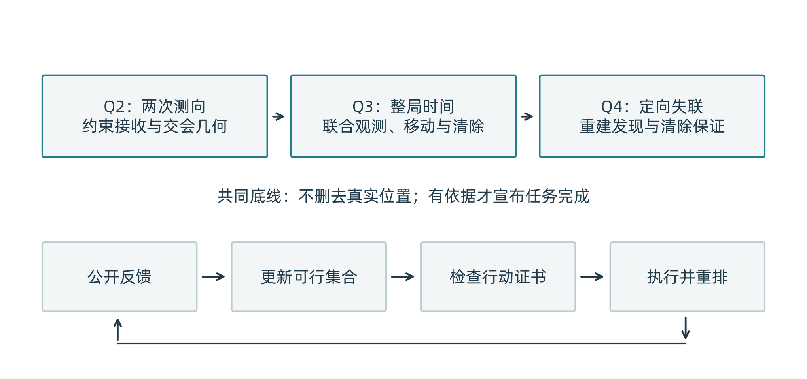

本文的贡献也据此分为三类：可证明的部分是接收条件、位置保留与连续覆盖；可由实验判断的部分是完整流程的平均代价变化；依赖经验取舍的部分是视差尺度、观测价值阈值与在线排序规则。后文将分别标注这些性质，避免用实验完成率替代数学证明，或用局部几何证明推出未经证实的整局性能结论。

# 2 问题定义与统一评价

## 2.1 场景、观测和信息边界

设目标圆域为 $\Omega=\{x\in\mathbb R^2:\|x\|\le1800\}$。第 $j$ 个源的位置为 $g_j$，固定接收半径为 $r_j\in[1000,1500]$ m。源在一局内静止，每个源占据唯一频道，实际源数 $N$ 未知，但满足 $10\le N\le16$。机器人从原点出发，以5 m/s移动。源域限定源的位置；按给定接口，检测点可以位于该圆域之外。[1,2]

全向源在 $\|p-g_j\|\le r_j$ 时能够接收。对于定向源，还要求检测点处于其发射半平面内。若 $n_j$ 为未知发射轴单位向量，则接收条件为

$$
\|p-g_j\|\le r_j,\qquad n_j^\mathsf T(p-g_j)\ge0. \tag{1}
$$

发射半平面包含边界。若接口已给出5 m内的近场响应，则可直接光学清除；但距离源很近也不能消除背向不可见性。光学清除仅要求距离不超过20 m，与发射方向无关。因此，无线电接收和光学清除必须按不同条件处理。

正常测向给出示向度 $\theta$，实际方向与之相差不超过 $\delta$。解析模型取 $\delta=1^\circ$；考虑读数保留两位小数，实际集合运算统一采用 $1.005^\circ$ 的保守包络。相同位置、相同频道的重复误差固定。我们不假设误差均值为零，也不把重复读数作为独立样本。

策略只使用自身位置、当前频道、题面先验以及公开检测和清除反馈。隐藏源坐标、接收半径、发射方向和场景类别仅供自建评价器在运行后核验，不进入策略。下文的示意图可以展示源的位置来解释几何关系，但这不意味着算法能够读取该位置。

## 2.2 先完成任务，再比较时间

设累计移动距离为 $L$，实际测向频道切换次数为 $N_s$，检测次数为 $N_m$，光学调用次数为 $N_o$，不同源成功清除次数为 $N_c$。按照给定计费规则，总虚拟时间为

$$
T=\frac{L}{5}+N_s+5N_m+3N_o+2N_c. \tag{2}
$$

光学调用无论成功与否都花费3 s，成功清除再加2 s；清除操作不切换测向机频道。各动作串行计费，不能用同时执行抵消代价。程序的现实运行时间另行记录，不等于式（2）的虚拟时间。

评价首先要求全部源实际清除且停止条件合法，然后比较 $T$。这样可以排除通过漏清或提前退出获得较低时间的策略。题目要求的每源平均时间记为 $\tau=T/N_c$，跨局统计先逐局计算再平均，不用 $\sum T/\sum N_c$ 替代。若 $N_c=0$，该指标不定义，该局仍保留为失败记录。

## 2.3 三种结论的使用方式

全文使用以下区分。“理论保证”表示在静态源、有界误差、合法接口响应和准确几何运算等前提下，由推导得到的结论；“实验结论”表示在明确的自建布局、误差条件和比较对象下观察到的结果；“启发式选择”表示为降低代价而采用、但没有全局最优性证明的规则。三者可以出现在同一方法中，却承担不同作用。例如，某测点保证接收是理论性质，是否值得绕路访问则需要完整流程实验回答。

# 3 模型与方法：从定位区域到完整行动链条

## 3.1 几何基础：为什么“定位得很小”还不够

一次带有有界误差的测向对应一个前向楔形，而不是一条精确射线。设检测点为 $S_i$，令 $u_i^-=(\cos(\theta_i-\delta),\sin(\theta_i-\delta))$、$u_i^+=(\cos(\theta_i+\delta),\sin(\theta_i+\delta))$，二维叉积记为 $[a,b]=a_xb_y-a_yb_x$。与读数相容的位置满足

$$
[u_i^-,x-S_i]\ge0,\qquad [u_i^+,x-S_i]\le0. \tag{3}
$$

将式（3）的楔形记为 $W(S_i,\theta_i,\delta)$，多次观测取交得到凸集合 $P=\{x:Ax\le b\}$。求解时先用线性规划检验可行性，再分别检查两个坐标的正负方向是否无界，最后求有界集合的顶点。对 $n$ 次测向，可枚举边界直线交点并逐点检查全部约束；这一直接算法的几何计算量为 $O(n^3)$，适合本题较少的单源测向数。空集表示观测与模型不相容，无界集合表示现有角度信息不足；不能强行输出一个有限定位直径。

**理论保证。** 若 $P$ 非空且有界，顶点集为 $V(P)$，则

$$
D(P)=\max_{u,v\in V(P)}\|u-v\|. \tag{4}
$$

原因是凸组合之间的距离不超过所有顶点对距离的最大值。这个结论使定位质量能够直接由顶点计算，但它没有保证半径 $D(P)/2$ 的圆可以覆盖 $P$。

图2展示了一个与合法测向相容的等边三角形反例。其顶点为 $(0,0)$、$(20,0)$、$(10,10\sqrt3)$，区域直径为20 m，最小覆盖圆半径却为 $20/\sqrt3\approx11.55$ m。若以一条最长边的中点为圆心、以10 m为半径，第三个顶点会落在圆外。因此，图2所指出的问题不是圆心选得不够巧，而是同直径圆本身可能不存在。对应的三次测向构造见附录A。

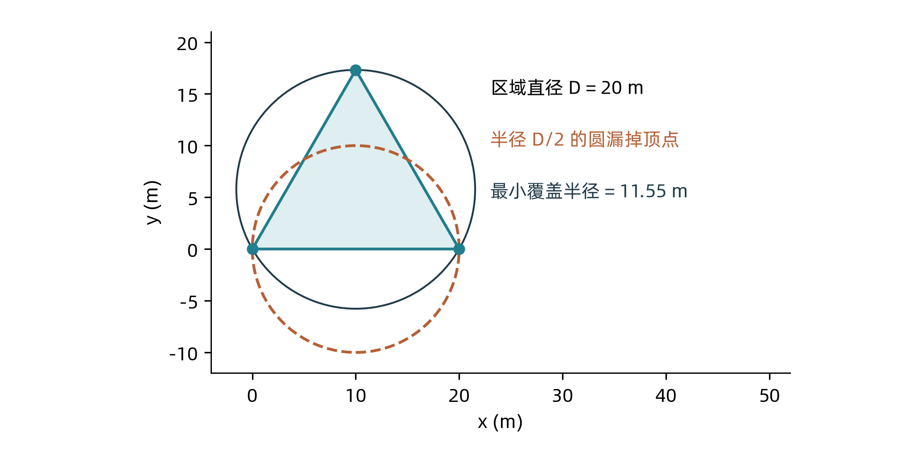

后续统一采用覆盖半径

$$
R(P,q)=\max_{v\in V(P)}\|v-q\|. \tag{5}
$$

由于圆盘是凸集，$R(P,q)\le20$ m 足以保证在 $q$ 清除。该条件可以偏保守，但不会将“区域看起来很小”误写为“一次清除必然成功”。这正是第一问对后三问的作用：建立可靠的行动判据。

## 3.2 Q2：先排除会失联和会退化的第二测点

**问题与第一次试错。** 第一次测向之后，最自然的尝试是向侧面走一段距离，或者直接沿示向度前进。图3说明这两种直觉都缺少必要条件。取首测点为原点、源为 $(1500,0)$，接收半径为1500 m。横移到 $(0,500)$ 后，与源距离增至1581.14 m，第二次检测失联；前移到 $(500,0)$ 则仍与源共线，纯角度交会区域可以继续无界。横向位移解决不了接收问题，前向位移也解决不了交会退化。

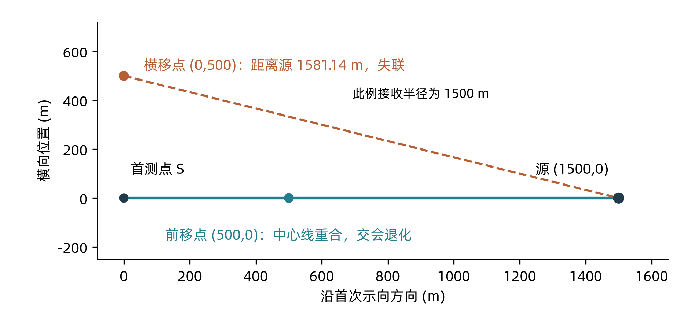

**方法：利用首次接收成功这一额外信息。** 以首测点 $S$ 为原点，以示向方向及其垂线为局部基向量 $u,v$，将候选源写为 $G=S+r(\cos\alpha\,u+\sin\alpha\,v)$，第二测点写为 $Q=S+au+bv$。正常示向度意味着 $5<r\le1500$ m、$|\alpha|\le\delta$。再与源域 $\Omega$ 相交，将所得真实初始可行域记为 $\mathcal F_1$。源的真实接收半径虽然未知，但首次接收已经告诉我们，它不小于 $r$；又由题面知其不小于1000 m。因此，对于固定候选源，所有相容半径均能再次接收的充要条件是

$$
\|Q-G\|\le\max(1000,\|G-S\|). \tag{6}
$$

对全部候选源同时要求式（6），便得到鲁棒接收区域。为给出与首测位置无关的显式表达，先用完整扇形 $5\le r\le1500$、$|\alpha|\le\delta$ 外包真实可行域，暂不利用目标圆域裁剪。令 $q^2=a^2+b^2$、$h=a\cos\delta-|b|\sin\delta$，则保证接收区域为

$$
a\ge0,\qquad q^2-10h+25\le10^6,\qquad q^2\le2000h. \tag{7}
$$

**理论保证。** 这一条件不是从有限源点上试出来的。对 $5\le r\le1000$，距离平方关于 $r$ 为凸函数，只需检查两端；对 $r\ge1000$，式（6）化为 $q^2\le2r(a\cos\alpha+b\sin\alpha)$，其中 $r=1000$ 最严格。再取角度区间内最不利投影 $h$，即得式（7）。因此，整个连续扇形都受到约束，而不只是某个采样网格。

**启发式选择与充分条件。** 接收成功仍不等于定位好。我们将锐化交会角至少20°作为避免近共线的设计要求，并排除第二点距源不超过5 m的情形。记

$$
\begin{aligned}
c_{\min}&=|b|\cos\delta-a\sin\delta,\\
M^2&=\max\{q^2+25-10h,\ q^2+1500^2-3000h\},
\end{aligned}
$$

在式（7）外再要求

$$
c_{\min}>5,\qquad c_{\min}\ge M\sin20^\circ. \tag{8}
$$

20°是设计阈值；一旦满足式（8），其非退化交会性质有连续几何依据。图4显示安全候选区域位于首条示向度前方两侧：过于靠近中心线时交会角不足，横移过远又可能失去接收保证。这是一个可直接检验的充分区域，不是所有可行测点的最大集合。

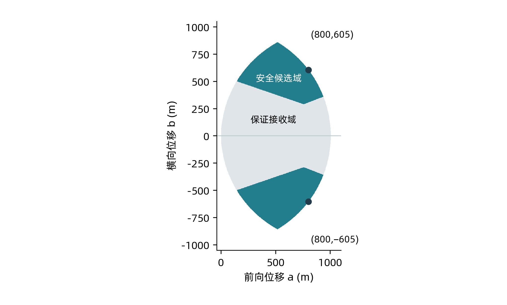

## 3.3 Q2的结果提出Q3：精度改善是否值得这段路

在安全候选域内，以两次角度楔形交集的最坏直径为局部目标。设第二次读数误差为 $\varepsilon_2$，可写为

$$
\min_{Q\in\mathcal C_{\rm safe}}\ \sup_{G\in\mathcal F_1,\,|\varepsilon_2|\le\delta}
D\!\left(W(S,\theta,\delta)\cap W(Q,\arg(G-Q)+\varepsilon_2,\delta)\right). \tag{9}
$$

第一次读数已经固定，源的角偏差 $\alpha$ 同时确定第一次误差，不能再独立增加一个“第一次误差变量”。数值计算用有限场景近似式（9）的上确界，并按真实扇区求交，不用线性化精度公式替代定位区域。

**数值结果。** 原设计在1°误差下采用50 m粗网格及5 m邻域加密，共评价335次可行候选，得到 $(a,b)=(800,605)$ m及镜像点。随后在1.005°包络下对固定的8个上侧偏移及其镜像复核，每点使用 $301\times11\times11=36,421$ 个源距离、角偏差和第二误差组合。$(800,605)$ 的采样最大直径为135.026 m，移动并检测一次花费205.602 s；$(500,500)$ 对应236.082 m和146.421 s。

图5将精度与代价放在同一张图上。较长偏移把本候选对的采样最大直径降低42.81%，但多花59.18 s。图中的连线仅连接固定库内的非支配候选；它既不是连续区域的完整帕累托前沿，也不证明135.026 m是连续最坏上界。

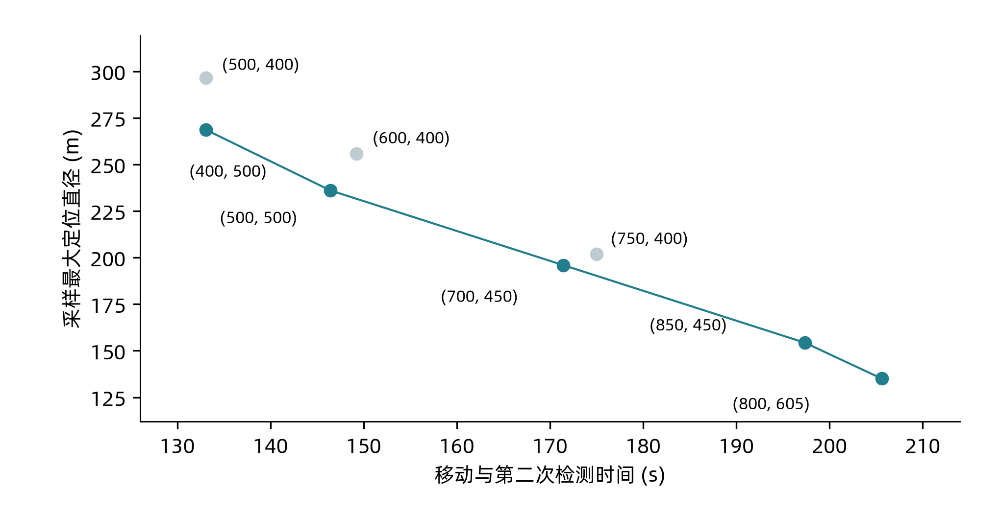

这一结果给第三问提出了新的目标：机器人最终需要清除全部源，而不是让某一次两测交会尽量精确。如果一个较短动作已经足以接近清除条件，剩余精度可能没有价值；如果某个测点还能同时收缩其他频道的位置集合，多付一次检测成本反而可能减少后续移动。因此，Q2提供的是可接收性和几何质量的判断工具，Q3必须重新评价完整任务代价。

## 3.4 Q3：将定位集合与任务排序放在同一个循环中

**状态重建。** 对已发现频道 $c$，维护包含所有相容位置的外包多边形 $P_c$。初始约束来自目标圆域、首次成功接收给出的1500 m距离上界及测向楔形；圆形边界采用32个外切支持半平面近似，后续正向观测继续与 $P_c$ 取交。选择外切近似，是为了保留圆周附近的合法位置。1500 m只是距离上界，不是该源的已知接收半径。

**理论保证。** 每一个加入的约束都包含真实源，故取交维持 $g_c\in P_c$。对于全向源，若 $R(P_c,q)<1000$ m，则在 $q$ 保证接收；若 $R(P_c,q)<20$ m，则在 $q$ 保证清除。实际程序在阈值内留少量数值余量，并逐顶点检查。若保证接收点出现无信号，或证书清除失败，算法报告模型或执行异常，不通过删掉不利位置解释矛盾。

**定位动作。** 沿最新示向方向建立包围盒，取其中心 $q_c$ 与覆盖半径 $R_c$。首次移动测量考察横向点

$$
q_c^\pm=q_c\pm\sqrt{20R_c}\,(-\sin\theta_c,\cos\theta_c). \tag{10}
$$

其中20表示清除半径20 m。仅保留满足接收证书的点，再选离当前位置较近者；两点均不合格时使用中心。之后在更新集合的中心继续测量，直到满足清除条件。横向偏移用来形成视差，尺度 $\sqrt{20R_c}$ 是固定几何启发式，不是最优控制解。

中心测量为后续收缩提供了依据。若 $P\subseteq B(q,R)$，从 $q$ 获得半宽 $\delta<30^\circ$ 的前向楔形，交集直径至多为 $R$；其任意方向包围盒中心的覆盖半径至多为 $R/\sqrt2$。这说明在实数模型中重复中心观测能够持续收缩。实现限制收缩迭代次数；若数值停滞，则用边长不超过28 m的有限网格覆盖当前包围盒，避免无限循环。

**观测共享。** 机器人停在一个测点时，其他频道可能也值得检测。但“可以接收”只说明动作合法，不能说明它值5 s及相应切频代价。联合方案先检查其他频道的接收证书，再将所有可能输出角度划分为16段，对每段构造覆盖其全部后验的较宽楔形。仅当每个非空后验包络都能被半径不超过 $\max(20,R_c/2)$ 的圆覆盖时，才执行共享观测。这个判据保护的是可能输出的收缩价值；它不保证随后选取的包围盒半径严格减半，更不直接保证整局省时。跳过的源始终保留在待清任务中。

**调度重建。** 将未完成搜索站和已知源的当前集合中心作为任务代表点，构造开放路线。对不同首任务分别生成最近邻路线，再作严格缩短路径的2-opt调整，仅执行选中路线的首任务，收到真实反馈后重排。图6把这一过程串起来：先维护可靠集合，再选当前行动，观测又会改变集合与后续任务。路线中的源位置只是代理点，所以静态路径长度最短也不能推出整局最优。

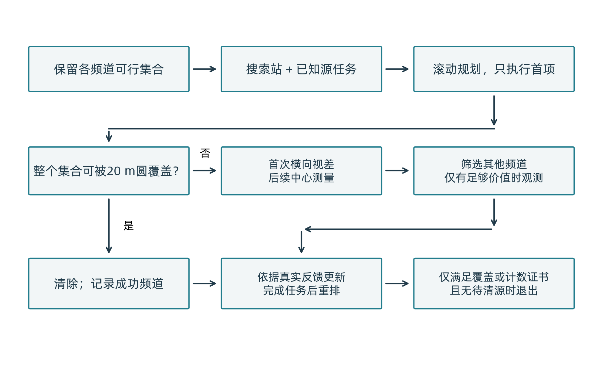

## 3.5 Q3：定位完成以后，还需要证明没有未知源

已知源全部清除，不等于任务结束。若实际源数只有10个，机器人不能等待“第16个源”出现；若还有源尚未发现，队列为空也不能成为退出理由。我们用中心站与半径1125 m圆周上的6个等角站构成七站发现方案。

**理论保证。** 原点足以覆盖半径900 m的内圈。外圈任一点与最近圆周站的角距不超过30°，而距离平方关于源的径向距离为凸函数，因此只需检查 $r=900,1800$ 两端。最坏距离不超过

$$
\max\left\{900,\max_{r\in\{900,1800\}}
\sqrt{r^2+1125^2-2r\cdot1125\cos30^\circ}\right\}
\approx999.11<1000\ {
m m}. \tag{11}
$$

图7说明七站方案的用途是保证发现。即使调度穿插了定位与清除，只要未清除且未发现的频道完成全部必要站点扫描，就不能在圆域内继续隐藏一个全向源。

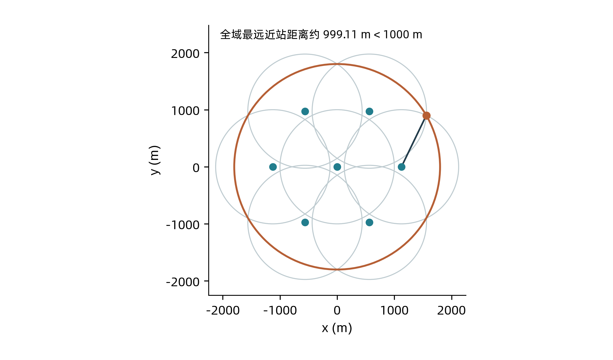

完整停止有两条途径：成功清除16个不同频道；或者所有已知源已清除，且未出现的频道已经在七站取得完整阴性记录。发现16个频道只允许取消剩余未知搜索，仍须完成已发现源的清除。少于16个时，发现数量达到下限10、连续无信号或待办队列暂空，都不能代替覆盖证书。任务数至多为7个搜索任务与16个完整定位清除任务；有限任务数保证不会无限搜索，但不等于任意现实截止时间内都来得及完成。

## 3.6 Q4：定向源使no-signal的含义改变

从Q3进入Q4时，正向测向仍然能够约束源的位置，但原先使用阴性读数的逻辑必须改变。图8中，机器人与源相距仅350 m，远小于1000 m，却位于发射背面而无信号。此时删去测点附近的一整个圆盘，会连同真实源一起删去。

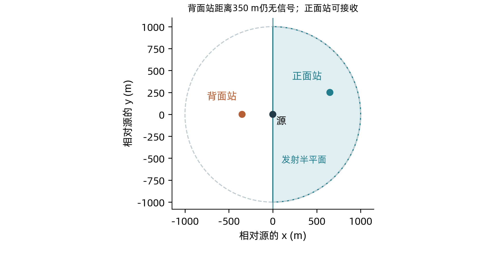

这个变化影响了两个层次。局部上，Q3的 $R(P_c,q)<1000$ 不再足以保证获得第二条示向度；全局上，七站圆盘覆盖也不再保证发现，因为所有近站仍可能落在某个源的背面。因此，不能只在Q3代码中增加一个“定向”标记，而要同时重建发现证书、定位失败分支和任务调度。

本文保留正向观测的集合更新，对单个无信号反馈不作整圆排除。若需要从阴性反馈进一步提取信息，必须联合保留源位置、接收半径和朝向之间的关系；这比单独维护位置多边形复杂，未被作为推荐方案的必要部分。

## 3.7 Q4：以近距凸包代替单纯圆盘覆盖

**理论保证：近距测站凸包引理。** 对任意源位置 $g$，若存在一组测站 $W_g$，满足

$$
g\in\operatorname{conv}(W_g),\qquad
\max_{w\in W_g}\|w-g\|<1000, \tag{12}
$$

则任意发射方向都至少能被其中一站接收。证明很直接：设 $g=\sum_i\lambda_iw_i$，权重非负且和为1。如果所有站均位于背面，即 $n^\mathsf T(w_i-g)<0$，加权求和将得到 $0<0$，矛盾。距离条件再保证该正面站处于接收半径之内。

该引理把“猜测发射方向”转为“让源被近站从几何上围住”。如果一个三角形的最长边小于1000 m，那么其中任意点到每个顶点的距离也小于1000 m。因此，用这样的三角网覆盖整个源域，就能为每一个可能源位置提供三个见证站。

推荐方案由原点、950 m内环上的12站，以及1870 m外环上错开15°的12站组成：

$$
\begin{aligned}
s_0&=(0,0),\\
a_k&=950(\cos(k\pi/6),\sin(k\pi/6)),\\
b_k&=1870(\cos(k\pi/6+\pi/12),\sin(k\pi/6+\pi/12)),
\quad k=0,\ldots,11.
\end{aligned} \tag{13}
$$

连接 $(s_0,a_k,a_{k+1})$、$(a_k,a_{k+1},b_k)$ 与 $(a_k,b_{k-1},b_k)$，形成36个三角形。全部边长小于1000 m，最长边为983.60 m；外环正十二边形的内切圆半径为 $1870\cos15^\circ=1806.28$ m，大于源域半径。图9显示，这一构造同时满足边界外包和局部近距凸包条件，因此覆盖结论适用于连续圆域内的任意位置与方向。

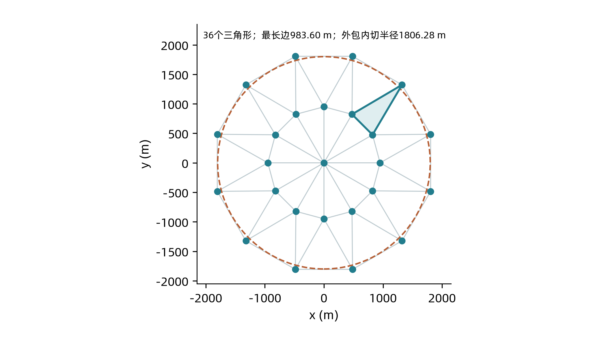

## 3.8 Q4：无线电失联后，如何把源真正清除

**局部方法。** 每个已发现频道仍维护位置外包多边形，首次观测由1500 m范围外包矩形、测向楔形与目标域外切64边形取交，后续只用正向示向度继续收缩。如果尚无第二条有效方位，先在定位区域最长顶点对的中点两侧、沿首测横向偏移300 m，优先访问较近的一侧；无信号时再尝试另一侧。这是争取交会机会的启发式，两侧都失败时也不删除 $P_c$。

**有限清除保证。** 若整个 $P_c$ 已位于某20 m圆内，直接清除；否则沿首测方向建立外包矩形，以边长不超过28 m的网格划分，依次在格心尝试清除。每格的半对角线最多 $14\sqrt2\approx19.80$ m，小于清除半径，所以含真源的格必被覆盖。图10说明这一步为何能够绕开无线电不可见性：需要覆盖的是保留下来的全部位置，而不是继续寻找有信号的点。

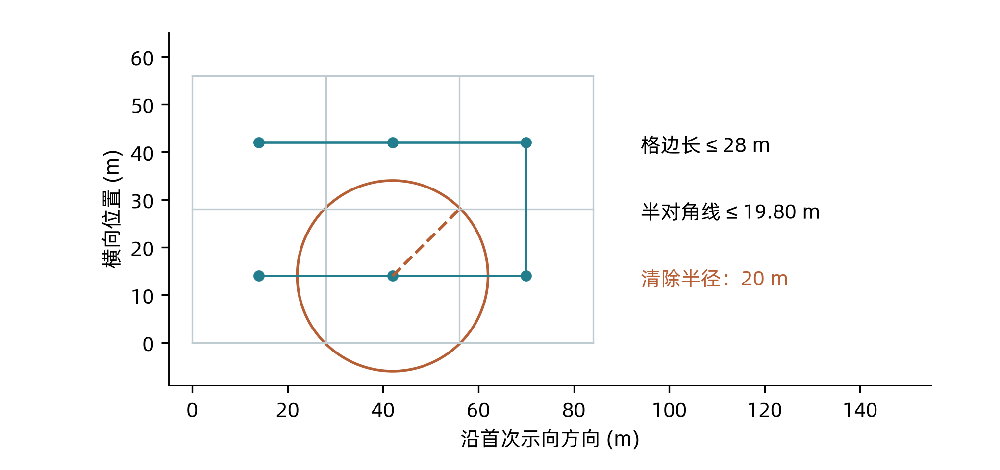

初始外包矩形长不超过1500 m，宽不超过 $2\cdot1500\sin1.005^\circ\approx52.62$ m，故最多使用 $\lceil1500/28\rceil\lceil52.62/28\rceil=108$ 个格心；后续正向交会只会缩小范围。这是有限终止的依据，不是实际平均光学次数。每次失败尝试的移动与3 s调用费用都计入式（2）。

**重新调度。** 将未扫描站与已发现源任务共同排序。源任务以 $P_c$ 的面积重心作为路线代理位置，退化时用最长顶点对中点；清除是否安全仍由式（5）判断，不能用重心代替覆盖核验。采用最近邻开放路径和有限轮2-opt，每完成一项任务后重排。对未发现频道保留必要扫描；对已知频道，仅在已有清除证书或该站所见位置区域角跨度小于3°时跳过低信息量检测。3°规则只影响代价，不承担发现证明。

最终退出条件为成功清除16源，或者25站全部必要扫描完成且已知未清源集合为空。完整性由三个环节连接：连续覆盖保证任何未知源至少能被发现；位置集合保留真源；有限光学覆盖清除已知源。每项外层任务至少完成一个站或清除一个源，因此至多25项搜索任务与16项源任务。此结论仍以模型成立、动作被接口接受、几何计算可靠且有足够现实执行时间为前提。

# 4 实验设计：将试错和最终判断分开

## 4.1 数据来源、比较对象与独立单位

本文不为改写重新生成“更好看”的验证布局，统计图由已有逐例记录重算。Q2是自建几何算例；Q3和Q4为按题面及接口规则实现的自建完整流程实验。自建源布局用于比较策略，不被解释为官方案例的概率分布。[3—5]

Q3的冻结基线是历史第十九轮保留的组合，联合方案使用集合定位、视差、跨频道观测筛选和任务行程规划。候选选择先使用开发材料和60个结构开发布局，随后冻结源码、配置、生成器及选择规则，再生成120个新布局。六类布局为均匀、外缘、聚集、最小接收半径、窄径向和接收边缘，各20个。每个布局配4种固定空间误差场及2种舍入环境，所以每方案共有960次运行，但独立布局仍只有120个。

Q4保留两个不同的问题。第一个问题是成熟25站方案是否优于31站初始基线，在两批互不重叠、各96个新布局中比较；每批含6类布局，每类16个，每布局配一个预定误差场，两个批次分别使用有界读数和舍入压力模型。第二个问题是成熟方案之后的动态替站与测站移动是否值得加入，在另120个新布局中进行5臂锁定验证，每布局配4种误差场和2种舍入环境，每臂960次运行。后者的参照已是成熟25站方案，不能把两个阶段的改善比例相加。

|证据组|独立布局|每布局条件|主要用途|
|---|---:|---|---|
|Q2固定候选复核|不适用|每候选36,421个几何场景|比较采样定位直径|
|Q3最终验证|120|4误差场×2舍入环境|联合方案及共同父方案消融|
|Q4历史验证|96+96，互不重叠|每布局1个误差场，各批1种误差解释|31站、25站及关键删减对照|
|Q4动态覆盖验证|120|4误差场×2舍入环境|成熟基线与4个候选比较|

## 4.2 统计方法与事前选择规则

同一物理布局上的算法使用相同误差条件，按配对方式比较。主要效应定义为 $100(1-\overline T_{\rm candidate}/\overline T_{\rm base})$，正值表示省时；图11、图15的纵轴使用相反符号的时间变化，正值表示变慢，图注逐一注明。完整清除数、均值、95%分位数（P95）和最大值同时保留，避免均值掩盖失败和长尾。

Q3按6类分层、以布局为块进行20,000次配对bootstrap；同一布局的4种误差条件一起重采样。Q4历史两批分别以布局为单位作10,000次配对bootstrap；最新验证以布局为块、6类分层作10,000次重采样，同一布局的8次条件重放保持在同一块中。区间只反映所用自建生成器中的采样不确定性，不代表未知官方场景的性能保证。

两问的后续候选均事先要求完整率不降低、平均降时至少5%、P95不恶化。最终验证不能用于重新调参或反复切换赢家。失败与超时预设计入 $\max(T,360000)$ s，最终相应矩阵未触发这一惩罚；所有慢例仍然保留。历史试错用于解释为什么修改模型，最终锁定结果用于判断是否保留方案。

## 4.3 理论与实现分别核验

几何验证包括区域为空、无界和退化的情形，以及角度跨零、同点误差固定和覆盖反例。原Q1、Q2测试分别为11项和8项；Q2另有144个场景与通用半平面求解器交叉比较，直径最大差约 $1.74\times10^{-12}$ m。Q3、Q4的既有核验还覆盖公开响应重放、清除计数、实际扫描记录与停止条件。这些检查支持本次所引用实现与记录的一致性，不能替代实数几何证明，也不构成浮点程序的形式验证。

官方记录单独处理。现有材料中可核验的Q3官方模拟器演练为17局，合计225个源均清除；但记录没有可靠的算法配置关联，不能据此估计本文联合方案相对基线的官方收益。Q4官方演练及两问各3次正式测试仍缺少可核验记录。本节之后的性能比较全部来自自建实验。

# 5 结果分析：哪些改进留下，哪些尝试被放弃

## 5.1 Q3的试错：集合变紧并不会自动省时

最初的直觉是，既然位置集合比两条中心线交点更可靠，就沿集合中心逐步逼近。开发对照却显示，中心逼近使整局均值增加11.44%；加入首次视差后仍慢5.52%，继续加入共享观测的组合仍慢0.99%。直到将集合中心与搜索站放入同一个任务排序过程，组合才在同一开发材料上降时12.83%。这些百分比是各开发组合相对冻结基线的比较，不是独立组件贡献，不能相加。

这一失败迫使我们改变解释：位置集合改善的是信息表达，而其行动价值取决于机器人将在哪里测量、接下来服务哪个目标，以及是否能减少其他任务的绕行。另两条看似能够增加信息的路径代价更高：单方位光学条带覆盖使开发均值增加92.18%，沿接收边界往返测距增加525.62%。它们在局部上可行，却不适合作为完整流程的常规动作。

历史共享冲突给出了更具体的例子。在一个保留的聚集案例中，仅收紧主目标的区域距离条件，使旧共享规则下的共享缓存从15个降至0个，总时间由903.16 s增至1811.84 s；多出的908.68 s全部来自移动。同时修正各共享频道自己的区域距离证书后，该例时间降至735.55 s。这个结果支持“主目标动作与跨频道机会必须一起设计”的机制解释，但不能从一个诊断案例推出所有布局都具有同样收益。

## 5.2 Q3的锁定验证：平均更快，但保留少量明显慢例

在最终120个新布局上，联合方案两种环境均完成全部运行。主模型平均总时间由3323.52 s降至2982.18 s，省时10.27%，95%区间为[9.14%, 11.35%]；舍入压力环境由3319.49 s降至2985.19 s，省时10.07%，区间为[8.95%, 11.15%]。这是冻结候选后的配对验证结果，支持其在本自建场景集合中的平均优势。

|误差环境|方案|均值/s|P95/s|最大值/s|完整清除局数|
|---|---|---:|---:|---:|---:|
|有界读数|冻结基线|3323.52|4517.29|5111.40|480/480|
|有界读数|联合方案|2982.18|3823.72|4217.81|480/480|
|舍入压力|冻结基线|3319.49|4505.79|5086.03|480/480|
|舍入压力|联合方案|2985.19|3827.73|4217.91|480/480|

图11进一步展示收益的分布。每点对应一个布局的4种误差条件合并结果，全部120个布局均被保留。外缘、最小半径等场景多数省时，但聚集类仍存在明显正向离群点。它说明平均改进确实覆盖多类布局，同时也提醒我们：不同布局可提供的共享和提前停止机会并不相同。

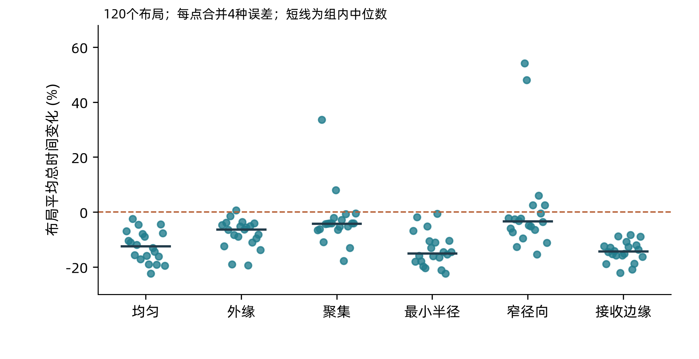

按单次运行统计，主模型435次更快、45次更慢；舍入压力环境433次更快、47次更慢。最差相对退化出现在一个聚集布局的空间哈希误差条件中：基线1063.06 s，联合方案2058.36 s，慢93.63%。基线在聚集区迅速发现16源，从而较早取消剩余搜索；联合方案的集合中心路线代理则可能先访问更多搜索站。此例移动多791.31 s、检测多185 s、切频多37 s。图11先合并误差条件，所以其中的最高点不等于这个单次运行的93.63%。

这并不推翻平均优势，但改变了它的使用范围：联合方案不能保证每局更快，现有路线代理也未充分计入“尽早发现第16源”的潜在价值。该反例在最终验证后保留，未用来重新调参。

## 5.3 Q3为何更快：省下的移动支付了额外观测

图12将同一批结果分解为实际动作费用。联合方案每局平均少用383.25 s移动，多用63.76 s检测和8.14 s切频，光学费用减少29.98 s，成功清除附加费用相同，合计净省341.33 s。因此，其机制不是单纯减少动作数量，而是用一部分额外观测避免更昂贵的后续行走。

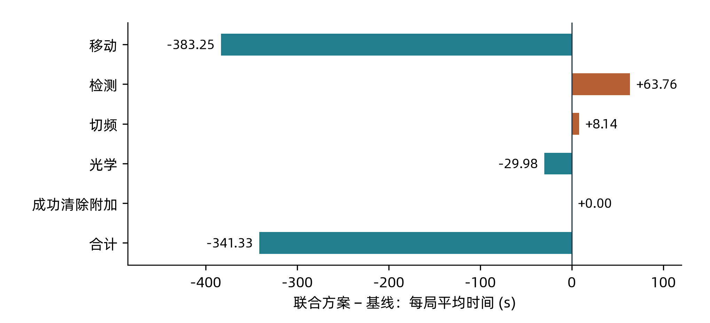

最终联合方案的960次运行没有失败光学尝试，也没有触发有限网格回退。这说明在本验证集合中，位置覆盖检查已足以支撑执行；网格仍作为异常收缩时的有限兜底存在，不能因其未触发而删掉理论上的失败分支。逐局每源平均时间在主模型由269.71 s降至242.21 s，在舍入压力下由269.36 s降至242.38 s。

图13用共同父方案分析几个组件。共同父方案除最终保留部分外，还包括切换任务时对目标原地再观测。删除这一额外步骤平均省25.00 s；删除首次视差平均慢243.72 s；删除完整行程规划慢37.20 s；删除共享信息门控慢27.00 s。各项均单独对同一父方案比较，因机制可能相互作用，不能把差值加成最终方案的总收益，也不能把视差或门控单独称为全部降时的原因。

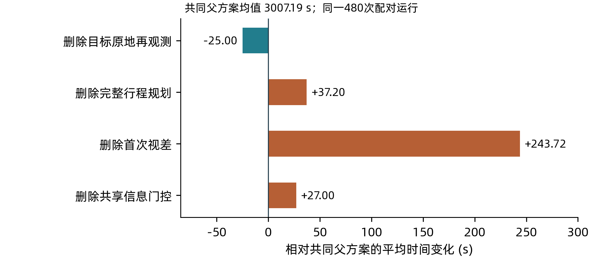

## 5.4 Q4为何保留25站：覆盖成立只是第一道门槛

Q4的第一轮关键试错不是调度，而是发现证书。一个具体21站布局在25 m粗网格上未发现漏点，细化后却在 $(898.68164,-241.25977)$ m处发现：1000 m内近站之间的最大方向空隙达到182.68021°，足以容纳一个避开全部近站的180°发射半平面。该反例否定了这个具体构造，并说明粗网格“未发现失败”不能代替连续证明；它没有证明所有21站布局都不可行。

随后，22站布局通过了连续凸包覆盖证书，但站数更少也没有稳定转化为整局更快。在最终保留的调度规则下，同批验证中22站方案分别比25站推荐慢5.24%和3.39%。一个保留案例中，25站方案只扫描12站便清除16源，22站方案却需要扫描16站，总时间增加67.12%。减少可选站数会改变发现顺序，并不保证减少实际扫描数。

图14将成熟推荐方案与31站初始基线及三个关键删减方案放在一起。两批各96布局中，25站推荐平均时间分别为6640.86 s和6694.69 s，相对初始基线降低41.83%和41.24%，配对95%区间分别为[40.35%, 43.24%]与[39.70%, 42.79%]。这里比较的是布局、在线排序和观测删减共同形成的方案，不能把全部约41%的收益归给从31站减到25站。

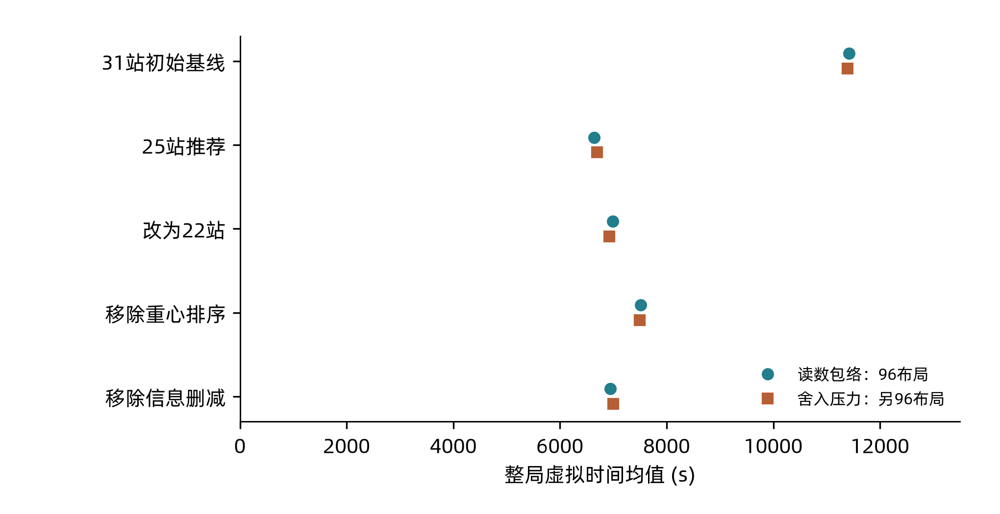

两批中所有图示方案均完整清除。25站推荐的P95分别为8694.62 s和9598.33 s，低于初始基线的13465.02 s和14367.42 s。读数包络批次移动耗时由9163.35 s降至4588.99 s；删除重心排序后，两批总时间均增加超过11%，删除低信息量观测筛选后均增加约4.6%。结果支持将连续发现、定位清除和任务访问顺序作为一个整体，而不是分别追求最少站数或最少检测数。

## 5.5 Q4后续试错：动态覆盖安全，却没有足够的整局收益

在25站方案成熟后，我们进一步尝试让已到达位置替代尚未访问的测站，或者在保持覆盖的条件下移动内环站。动态替站只有在更新站集仍具备全域证书时才接受；测站移动优化当前点到一个后续代理任务之间的两段距离，同时保持相邻三角形边长和方向。优化器返回成功后仍独立重建三角网核验证书，证明预算不足就保留原站。因而，“更新合法”与“更新有用”是两个分开的判断。

这类尝试此前已有警示。在同一24布局开发集中，先搜索后清除、两站发现窗口和分区承诺分别使均值变慢12.98%、17.47%和13.95%。固定阶段虽然简化了决策，却限制了顺路观测和及时清除。后续最有希望的替站与移动组合在开发中省时2.328%，仍未达到5%的替换门槛；之后的锁定验证用于检验其可迁移性，没有据此新增机制或调参。

最终5臂矩阵共4800次运行均完成清除。结果如下。

|方案|均值/s|P95/s|最大值/s|相对25站推荐省时/%|
|---|---:|---:|---:|---:|
|25站推荐|6744.38|9497.47|11986.29|0.000|
|历史自适应定位|6614.15|9417.57|12592.28|1.931|
|仅动态替站|6734.42|9497.47|11986.29|0.148|
|仅测站移动|6740.98|9460.06|11928.43|0.050|
|替站与移动组合|6719.67|9460.06|11928.43|0.366|

图15保留了所有布局的配对变化。组合的平均省时为0.366%，95%区间为[−0.183%, 0.921%]，跨过零；P95仅下降0.394%。其移动平均少37.00 s，却多出6.86 s检测、3.97 s光学和1.45 s切频，净省24.71 s。历史自适应定位在表中均值较低，但既未达到5%降时门槛，最大值也更高，不能事后按最低样本均值更换赢家。

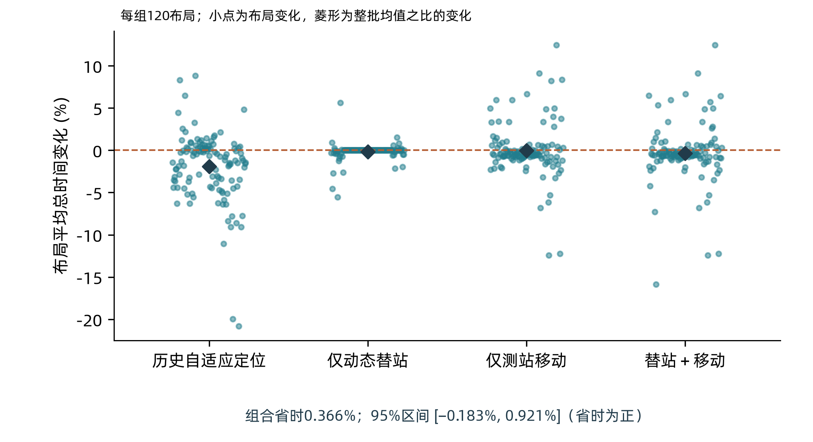

最差反例解释了为什么局部路径改善不能保证整局收益。在一个均匀布局的正误差条件中，动态组合由4228.69 s变为5653.40 s，慢33.69%，两者均清除16源。候选移动首个内环站103.88 m，局部预测路线缩短42.06 m，但实际扫描站数从7增至19，检测次数从119增至242，第16个频道的首次发现从2093.29 s推迟到4811.12 s。该例没有发生动态替站，因此不能把退化归因于未执行的操作。

逐动作记录支持“测站移动改变发现与服务顺序，推迟数量上限停止”的解释；由于没有逐项反事实撤回实验，不能为某一次动作分配独立因果损失。平均结果和反例共同导向同一个取舍：保留有连续证书和稳定收益的25站推荐方案，将动态覆盖视为可行但收益尚不足的扩展，而不是论文必须包装成成功的新方法。

# 6 讨论

## 6.1 三问真正共享的是证据，而不是同一个最优点

Q2、Q3、Q4的衔接可以理解为逐步改变“什么值得优化”。Q2先建立合法的第二测点区域，并在其中比较两测定位质量；Q3发现这种质量必须放回完整任务中计价；Q4又揭示，若可见性模型变化，连“这个动作保证获得信息”都需要重新证明。贯穿三问的不是一个固定偏移，而是位置集合、行动充分条件和完成证据之间的关系。

这一结构也解释了本文为何同时保留证明、正结果和负结果。几何证明限制哪些位置不能删除、哪些搜索不能省略；实验比较决定在合法动作中选哪一个更合算；失败案例则指出代理目标没有表达什么。三者分别回答可靠性、平均效果和适用边界，不能互相替代。

## 6.2 效率瓶颈从局部测向转向发现顺序

两问的长尾反例都与发现顺序有关。达到16个已知源之后可以取消未知搜索，这使某些发现动作具有跳变式价值：它可能直接消除一批后续任务。当前路线代理主要使用几何距离和位置中心，对这种提前停止价值刻画不足。因此，局部路线缩短后整体变慢并不矛盾，而是说明所优化的代理量与实际目标之间仍有差距。

下一步更有针对性的研究应比较“距离代理”与“同时考虑未知频道发现和上限停止机会的任务价值”，并保持几何证书与其他机制固定，在新布局上检验是否降低长尾。现有证据尚不足以给这种任务价值设定可靠的官方概率先验，所以不能直接从自建场景频率推出一个被证明最优的策略。

## 6.3 完整性、数值实现与实验外推的边界

连续覆盖和有限清除证明依赖题面物理模型：源静止、误差有界、最小接收半径与半平面发射规则成立、动作反馈合法。若允许移动源、遮挡或小于半平面的发射扇区，现有25站证明需要重新建立。程序使用外包多边形和浮点余量，尚未采用区间算术对全部退化输入作形式验证；已通过的有限测试不能写成机器级无条件保证。

覆盖证书的审计本身也需要核验。已有独立检查发现旧审计器可接受由重合原点构成的退化假三角证书，随后通过真实平面三角网重建、外包边界检查和实际扫描记录复核补足。原推荐方案实际生成的25站构造有效，因此该漏洞不等于原算法已经漏清，但它提醒我们：证书文件写着“通过”，不等于证书检查逻辑一定正确。

所有统计收益都限于相应自建场景和冻结比较。多次条件重放不是更多独立布局；开发轮次中的均值也不能跨批拼成连续进步曲线。Q3官方演练17局的平均总虚拟时间为3506.99 s、逐局每源时间均值272.77 s，但缺少版本关联，无法归属于本文联合方案。两问正式测试及Q4官方演练仍待补充，因此本文可以作为方法与证据完整的论文初稿，不能被当作已经取得正式成绩的最终提交稿。

# 7 结论

本文从两次测向定位出发，建立了面向完整搜索清除的连续方法。Q2利用首次接收成功推导第二测点的鲁棒接收域，再约束交会退化；其数值结果揭示精度与移动的权衡。Q3将这一局部问题放入整局时间目标，以位置集合、观测共享和滚动任务排序协同降低代价。Q4面对定向源的no-signal歧义，改用近距凸包的连续发现证书与有限光学覆盖，再评价调度收益。

自建配对实验支持Q3联合方案的平均降时，也支持Q4保留成熟25站方案；最差慢例和动态覆盖的弱收益同时表明，局部几何质量、较少测站和较短代理路径都不足以保证整局更快。本文的最终结论是：可靠完成需要几何与计数依据，效率改善需要完整流程验证，而两者之间仍需谨慎处理在线发现顺序。正式成绩和官方环境下的版本化对照有待后续补充。

# 参考文献与材料来源

[1] 全国大学生数学建模竞赛组委会. 2026年高教社杯全国大学生数学建模竞赛B题：无线电干扰源的快速自动定位与清除. 2026. 本文依据所提供题面。

[2] 全国大学生数学建模竞赛组委会. 2026年B题附件1：模拟器使用说明；附件2：模拟器通信接口说明及编程指南. 2026. 本文依据所提供附件与既有文本核验。

[3] 本项目研究记录. 问题一、二建模、候选点复核及几何验证数据. 未公开工作材料，2026.

[4] 本项目研究记录. 问题三冻结基线、机制试验、最终配对验证及官方演练核验资料. 未公开工作材料，2026.

[5] 本项目研究记录. 问题四连续覆盖构造、历史验证、动态覆盖锁定实验及反例记录. 未公开工作材料，2026.

以上[3—5]用于标明自建证据来源，不作为公开发表文献或独立外部基准。本文未据未核验的文献主张算法首创性。

# 附录A 复核所需的最小补充

## A.1 第一问等边三角形的测向构造

取三个检测点及其示向度如下，误差半角为1°。

|检测点|横坐标/m|纵坐标/m|示向度/°|
|---|---:|---:|---:|
|$S_1$|−1000|0|1|
|$S_2$|520|$-500\sqrt3$|121|
|$S_3$|510|$510\sqrt3$|241|

三条扇区下边界分别沿等边三角形三边，第三顶点相对相应边的偏角为0.98247°，小于扇区宽度2°，上边界不再截去三角形。取其中心为真实源时，三个测向误差绝对值均约0.67248°，测点距离约1010.017 m，选择1200 m接收半径即可满足题面。因此，图2反例不仅是任意凸集反例，也能由合法测向产生。

## A.2 Q2固定候选库的完整数值

|偏移 $(a,b)$/m|移动距离/m|移动与检测/s|采样最大直径/m|库内非支配|
|---|---:|---:|---:|---|
|(400,500)|640.312|133.062|268.653|是|
|(500,400)|640.312|133.062|296.407|否|
|(500,500)|707.107|146.421|236.082|是|
|(600,400)|721.110|149.222|255.889|否|
|(700,450)|832.166|171.433|195.946|是|
|(750,400)|850.000|175.000|201.861|否|
|(850,450)|961.769|197.354|154.298|是|
|(800,605)|1003.008|205.602|135.026|是|

采用1.005°保守误差包络，各点均复核36,421个场景；镜像偏移指标相同。该表只报告从首测点出发移动并检测一次的费用，不包括后续定位、清除与其他频道任务。

## A.3 结论性质与复现范围

|主张|性质|适用条件或证据|
|---|---|---|
|Q2安全候选内保证接收、避免退化|理论保证|式（7）、（8）的完整扇形外包及误差界|
|偏移(800,605)采样最大直径135.026 m|数值结果|固定搜索与36,421场景复核，无连续全局认证|
|Q3已知源收缩与全向七站发现|理论保证|真源保留、接收下限、合法反馈及准确运算|
|视差尺度、16段价值筛选与2-opt排序|启发式设计|合法性部分可证明，整局效率靠配对验证|
|Q3平均降时约10%|实验结论|120个新自建布局，两种环境分别统计|
|Q4连续发现与有限光学清除|理论保证|闭半平面、最小接收半径1000 m、20 m清除半径|
|Q4推荐相对初始基线平均降时约41%|实验结论|两批各96个自建布局，整套方案比较|
|动态覆盖组合不替换25站推荐|实验取舍|未达5%门槛，主要区间跨零，慢例保留|

本次初稿所附绘图脚本只重绘解析几何和既有统计，不重新执行大规模仿真。完整策略源码、冻结配置、逐动作记录及原复现入口保留于已有支撑材料。图的源数据与本次核查结果随初稿提供。

# 附录B 初稿待补事项与AI辅助说明

正式测试与版本关联的缺口已在第4.3节和第6.3节说明。作者后续需补齐Q3、Q4各3次正式测试及原名日志、Q4官方演练，并据实确认历史AI工具型号和人工核验情况。

本次中文初稿重写使用AI辅助梳理既有材料、调整叙事、编写图文与执行数值及排版核查。本文保留理论、实验和启发式选择的区别，未新增模拟正式成绩；历史AI使用详情与参赛成员的最终人工审阅应据实补全。
