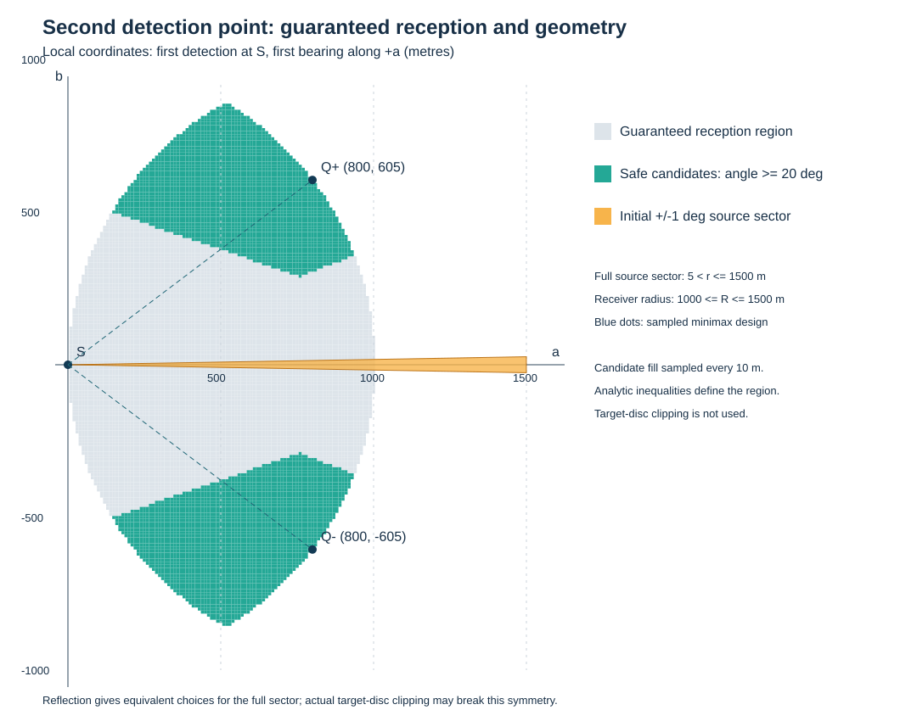

# 第二问：单次示向信息下第二检测点的鲁棒选择

## 1. 结论与本问采用的标准

建议采用“**前向侧移、保证接收、避免共线、按最坏定位直径择优**”的策略。第二个检测点不是简单位于首测点的垂线上，也不能凭一次角度测量宣称能实现 90° 交会。

本问仅给一个示向度，没有数值坐标，也没有“较好”的定量定义。本文选择：先保证任意与首次读数相容的全向源在第二点仍处于接收范围，再限制交会几何，最后最小化最坏情形下两次角度扇区交集的直径。此标准与第一问直接衔接，不需要引入位置或误差的概率分布。

我们给出：① 对实际初始可行域成立的通用候选区域；② 不依赖首测点具体坐标、可显式计算的保守候选区域；③ 可复现的数值择点算法；④ 需要人工审查的建模选择。

## 2. 一次测向能确定什么

记首测点为 S，示向度为 θ，误差半角 δ=1°。定义正交基

\[
u=(\cos\theta,\sin\theta),\qquad v=(-\sin\theta,\cos\theta).
\]

在局部坐标系中，候选源和第二检测点分别表示为

\[
G=S+r(\cos\alpha\,u+\sin\alpha\,v),\qquad
Q=S+a u+b v.
\]

已得到正常示向度，因此 5<r≤R，而该源固定但未知的有效接收半径 R∈[1000,1500]。初始可行域为

\[
\boxed{\Omega=\{G:\|G\|\le1800,\quad5<\|G-S\|\le1500,
\quad |\alpha|\le\delta\}.}
\]

特别注意：1000 米是接收半径的下限，不是干扰源与检测点距离的上限；r 可能大于 1000 米。正常读数还排除了 r≤5 米。

初始读数已经固定，场景变量 α 决定第一读数误差为 −α，不能再独立添加一个自由的“第一次误差”而重复计算不确定性。第二读数误差 ε₂ 只知道位于 [−δ,δ]；本文取区间最坏情形，不使用独立均匀误差假设。

## 3. 定位效果与交会几何

令 r₁=||G−S||，r₂=||G−Q||，φ∈[0,π] 为 G−S 与 G−Q 的夹角。两条视线近共线时，即 φ 接近 0° 或 180°，角度误差会造成很大的距离不确定性。

将角度扇区在真实源附近近似为横向半宽 rᵢtanδ 的条带，其交集平行四边形的直径为

\[
\boxed{D_{\rm lin}(G,Q)=
\frac{2\tan\delta}{|\sin\varphi|}
\sqrt{r_1^2+r_2^2+2r_1r_2|\cos\varphi|}.}
\]

推导：取第一条视线为横轴，位置偏差为 (zₓ,zᵧ)，两条带边界可写为 zᵧ=±r₁tanδ、−sinφ zₓ+cosφ zᵧ=±r₂tanδ。解出四个顶点，选择距离原点最远者并乘 2，得到上式。

此式用于解释几何，不作为有偏读数的严格误差界：真实扇区宽度随距离变化，读数中心也不必经过 G。数值算法直接计算第一问的真实扇区交集直径。

由公式可见：

- 在 r₁、r₂ 固定的比较条件下，90° 交会最好；近 0° 或 180° 都不好。
- 改变 Q 同时改变 r₂ 和 φ，不能仅最大化交会角而忽略距离。
- 若假设 G=S+ru，90° 交会要求 a=r；但一次示向度没有给出 r。因此不能预先对所有可能源实现 90° 交会。
- b=0 的纯前进动作，对仍在前方中心射线上的源可产生两个同向扇区，其交集仍无界。

## 4. 保证接收的候选区域：利用首次成功接收信息

对一个给定候选源 G，首次接收成功意味着

\[
R\in[\max(1000,r_1),1500].
\]

因此在所有与首次观测相容的 R 下保证第二点仍在接收范围，充要条件为

\[
\|Q-G\|\le\max(1000,r_1).
\]

对所有候选源同时要求，即得到

\[
\boxed{\mathcal C_{\rm rec}(\Omega)=
\bigcap_{G\in\Omega}\overline B\bigl(G,\max(1000,\|G-S\|)\bigr).}
\]

这是题目不确定性下的保证接收区域，不是“以猜测源位置为圆心画一个 1000 米圆”。若 Q 不在此交集中，就存在一个与首测相容的源位置及接收半径，使第二次检测失败。

保证接收不必然保证有示向度：当 ||Q−G||≤5 米时返回 near，可直接光学定位清除。若必须取得第二个正常示向度，应进一步排除所有距候选源不超过 5 米的位置。下文的候选区域会直接保证这点。

### 4.1 不依赖具体 S 的显式保守区域

为给出可直接实施的公式，暂不利用目标圆域的裁剪，并将开端点 5 闭合，使用外包扇形

\[
\Omega_0=\{S+r(\cos\alpha\,u+\sin\alpha\,v):5\le r\le1500,\ |\alpha|\le\delta\}.
\]

因为 Ω⊆Ω₀，对 Ω₀ 成立的保证也对真实 Ω 成立。对完整扇形，定义

\[
q^2=a^2+b^2,\qquad h=a\cos\delta-|b|\sin\delta.
\]

则保证接收区域可显式写为

\[
\boxed{a\ge0,\quad q^2-10h+25\le10^6,\quad q^2\le2000h.}\tag{1}
\]

证明如下。设 t(α)=a cosα+b sinα，则第二点到源的距离平方为

\[
d_2^2=q^2+r^2-2rt(\alpha).
\]

在 5≤r≤1000 上，d₂² 关于 r 是凸函数，最大值在 r=5 或 1000 取得；故只需分别满足这两个距离不超过 1000 米。在 1000≤r≤1500 上，条件 d₂≤r 等价于 q²≤2rt(α)，其中 r=1000 的约束已迫使 t(α)≥0，其余更大的 r 不会更严格。又 r=1000、α=0 的约束迫使 a≥0；在 a≥0 时，t 在 [−δ,δ] 的最小值在端点取得，等于 h，代入即得式 (1)。

式 (1) 等价于四个圆盘的交集：对 r=5、1000 以及 α=±δ，均要求 ||Q−(S+r eα)||≤1000。这里是“完整扇形对应的精确保证接收区域”，相对使用目标圆域裁剪后的 Ω 则是保守子集。

这还解释了为什么通常要向前侧移：若 a=0 且 b≠0，则 h<0，式 (1) 不成立；纯横向移动不能保证保住处于最远接收边界的源。

## 5. 排除差交会角，得到最终候选区域

定义锐化交会角 β=min(φ,π−φ)，选择 β≥γ。本文用 γ=20°，其作用是剔除病态几何，**不是题面规定的常数，也不是声称 20° 最优**。

对实际 Ω，通用候选区域为

\[
\boxed{\mathcal C_\gamma(\Omega)=\{Q\in\mathcal C_{\rm rec}(\Omega):
\forall G\in\Omega,\ \|Q-G\|>5,\
\frac{|(G-S)\times(G-Q)|}{\|G-S\|\|G-Q\|}\ge\sin\gamma\}.}\tag{2}
\]

若利用目标圆域可显著排除某些距离和方位，可以直接对式 (2) 做约束优化。离散检查式 (2) 本身不等于连续保证，因此本次实现采用下面的解析充分条件。

对 Ω₀，令

\[
c_{\min}=|b|\cos\delta-a\sin\delta,
\quad M=\sqrt{\max\{q^2+25-10h,\ q^2+1500^2-3000h\}}.
\]

在 cmin>0 时，对任意 α∈[−δ,δ]，均有

\[
|b\cos\alpha-a\sin\alpha|\ge c_{\min},\quad d_2\le M,
\quad |\sin\varphi|=\frac{|b\cos\alpha-a\sin\alpha|}{d_2}.
\]

所以最终采用的显式候选区域为

\[
\boxed{\mathcal C_{\rm safe}=\{S+a u+b v:\ (1)\text{成立},\quad
c_{\min}>5,\quad c_{\min}\ge M\sin20^\circ\}.}\tag{3}
\]

式 (3) **连续地保证**任意相容源仍可接收、与第二点相距超过 5 米、且 β≥20°。因为 d₂≥|b cosα−a sinα|≥cmin，近距排除也成立。条件 cmin/M≥sinγ 用了分别取下界和上界的方法，可能偏保守，不是式 (2) 的充要条件。

候选区域关于示向度轴对称，分成前方两侧的两块。选择哪一侧可根据移动可达性、后续路线或真实 Ω 的裁剪结果决定；题面未给障碍信息，本问不虚构障碍代价。附件 1 允许机器狗移动到目标圆域之外，因此不默认给 Q 增加 ||Q||≤1800 的限制。

在式 (3) 内，两次真实视线的最小方向分离不少于 20°；考虑两次各 1° 读数误差，测量中心方向的最小分离不少于 18°，大于两扇区半角之和 2°，它们不共享非零衰退方向。因此角度交集有界；且真实源在两扇区内，交集非空。



图中灰色为完整扇形的保证接收区域，绿色为式 (3) 的安全候选区域，橙色为初始测向扇形；填色以 10 米网格展示，边界以解析公式为准。

## 6. 候选区域内如何择点

对每个 G∈Ω 和 ε₂∈[−δ,δ]，构造第二次可能读数

\[
\theta_2=\operatorname{atan2}(G_y-Q_y,G_x-Q_x)+\varepsilon_2.
\]

令 W(S,θ) 表示误差半角 δ 的扇区，采用第一问的算法定义

\[
P(Q;G,\varepsilon_2)=W(S,\theta)\cap W(Q,\theta_2),
\]
\[
\boxed{J(Q)=\sup_{G\in\Omega,\ |\varepsilon_2|\le\delta}
\operatorname{diam}P(Q;G,\varepsilon_2),\qquad
Q^*\in\arg\min_{Q\in\mathcal C_{\rm safe}}J(Q).}\tag{4}
\]

式 (4) 是目标模型；本次代码用 Ω₀ 的离散场景近似它，得到一个可实施的优选点，**未证明连续全局最优**。交集 P 使用纯角度多边形，不加入接收圆和目标圆；因此其直径也是加入这些附加约束后的可行域直径的保守上界，而不是混淆二者。

算法步骤：

1. 将首测点平移到原点、首测示向度旋转到局部横轴。
2. 用式 (3) 解析筛选候选点，保证接收及交会几何。
3. 对半径、首测真实角偏差和第二误差建立场景网格。
4. 对每个点和场景，构造四个半平面，枚举边界交点，求有效顶点最远距离。
5. 最小化场景最大值；数值相同时优先移动更短者。粗网格后在最优邻域加密。
6. 对优选点用更密场景网格复核，再通过 Q=S+a u+b v 还原实际坐标。
7. 到达 Q 并读数后，使用第一问算法更新区域；是否可清除另行用覆盖半径检验，不能由两次测向自动推断。

每个场景只有四个半平面、至多六个边界交点，单次几何计算为常数规模。若候选点数量 N、源位置场景数量 K、第二误差场景数量 L，总量级为 O(NKL)。代码对场景向量化。

## 7. 数值结果：通用完整扇形算例

这里的数值是自行构造的通用设计验证，不是题面提供的观测数据或模拟器正式测试。

设 S=(0,0)、θ=0°，γ=20°。搜索半径取 51 个值（5.001 至 1500 米）、首测真实角取 5 个值、第二误差取 5 个值，总计 1275 个场景；候选点先以 50 米网格搜索，再在最优邻域以 5 米加密，共评价 335 次可行候选（包括粗细网格重复点）。仅搜索 b>0 一侧，另一侧由对称性得到。

获得优选局部坐标

\[
\boxed{(a,b)=(800,605)\text{ 米，或 }(800,-605)\text{ 米}.}
\]

对应实际坐标为

\[
\boxed{Q=S+800(\cos\theta,\sin\theta)\pm605(-\sin\theta,\cos\theta).}
\]

采用 301 个半径、11 个首测真实角和11个第二误差，共 36,421 个场景加密验证：

| 方案 | 局部坐标（米） | 移动距离（米） | 移动加一次检测（秒） | 场景最大多边形直径（米） |
|---|---|---:|---:|---:|
| 本次优选 | (800,605) | 1003.008 | 205.602 | 134.284 |
| 较短移动对照 | (500,500) | 707.107 | 146.421 | 234.695 |
| 前向侧移对照 | (750,400) | 850.000 | 175.000 | 200.670 |

计时只计本问从 S 到 Q 的移动距离/5，加检测 5 秒；追踪同一频道，无需切换频道，不包含后续清除。

三个点均满足解析候选条件。当前优选点相对 (500,500) 将场景最大直径降低约 42.78%，但增加约 59.18 秒移动时间。这说明精度与时间确有取舍。纯横移 (0,500) 在 G=(1500,0)、R=1500 时距离约 1581.14 米，会丢失信号；纯前移 (500,0) 对前方中心线源会产生无界角度交集，不适合作为保证改善的方案。

优选点的加密场景最坏值与粗场景值相同，但这不证明网格之间没有更坏情形。接收和角度保证来自解析不等式，而非这 36,421 个样本。134.284 米是**已测场景最大值**，不是经认证的连续最坏上界。

## 8. 供人工审查的选择与不确定性

| 审查点 | 当前采用 | 其他方向及影响 |
|---|---|---|
| “较好”如何量化 | 最坏多边形直径最小 | 可改为最小覆盖圆半径，更贴近清除；面积小不一定排除细长区域 |
| 接收风险 | 对所有相容源保证第二次接收 | 可允许失联并设计补救，可能节省时间，但要明确失败处理 |
| 位置及误差分布 | 不引入概率先验 | 若用期望误差或成功概率，必须说明先验依据，不能将未知自动当均匀 |
| 目标圆域 | 用 Ω₀ 外包，提供通用闭式区域 | 代入实际 S、θ 后裁剪 Ω，可放宽候选区域并降低保守性；左右可能不对称 |
| 交会角阈值 | γ=20° 的充分条件 | 阈值可调，或直接以接收区域为约束优化精确直径；当前不宣称阈值最优 |
| 精度与时间 | 第二问主目标为精度 | 若优先时间，建议规定移动预算 B，增加 ||Q−S||≤B；也可报告时间—误差帕累托曲线，避免任意混合单位 |
| 数值最优性 | 50 米粗网格＋5 米局部细化 | 可升级连续优化和区间认证；当前点只是该搜索的优选结果 |
| 接口角度舍入 | 数学模型严格按 ±1° | 附件 2 读数保留两位小数，若舍入误差额外叠加，后续需统一将 δ 扩为 1.005°并重新推导/计算，不能只改一个常数 |

**建议人工优先确定的两点**：第一，论文是否接受“最坏定位直径”作为本问效果指标；第二，第二问是否需同时强调移动时间。现有主方案已完整可用，这两点决定是否需要改目标函数，而不影响保证接收区域的推导。

## 9. 验证、限制与复现

执行 8 项自动测试，覆盖候选点和镜像、共线/横移/不可接收点排除、密网格核对解析几何保证、平移旋转不变性、反射对称性，以及向量化直径算法与第一问通用求解器逐例比较。另运行完整设计搜索和 36,421 场景验证。

对抗式检查：

- 不将 1000 米误当首次距离上限，也不将 1500 米误当所有源都具备的接收半径。
- 显式利用同一源 R 固定且首测成功的信息；R 的最小可行值随候选源距离变化。
- 检查“90° 最优”的固定距离前提，不用未知源位置直接画一个唯一第二点。
- 正常首测意味着 r>5；near 是可清除的成功近距发现，不能视为丢失信号。
- 未对同地点重复观测赋予独立误差收益。
- 网格实验与连续保证分开，有限样本没有冒充全局证明。
- 与第一问一致：D≤40 米不充分保证存在半径20米的覆盖圆。本次134米量级更不能声称两次即可清除。

复现命令（在项目根目录）：

```bash
python question2/strategy.py
python -m unittest discover -s question2 -v
python -m unittest discover -s question1 -v
```

`strategy.py` 提供 `candidate(q)` 判定局部坐标是否属于式 (3)，以及 `to_world(q, first_position, bearing_deg)` 转换为实际坐标；`results.json` 保存实际运行结果。实现的近距阈值、接收范围和误差参数按题面固定，不是适用于任意设备参数的通用库。
