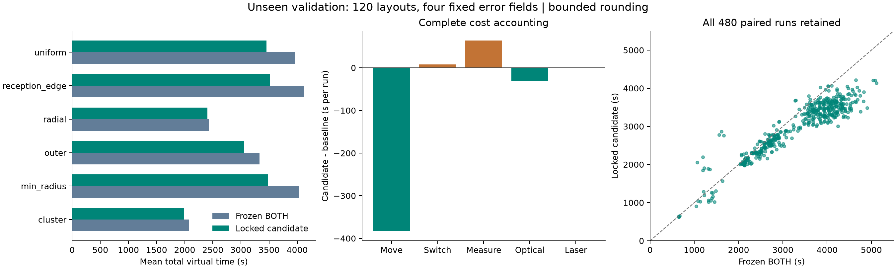
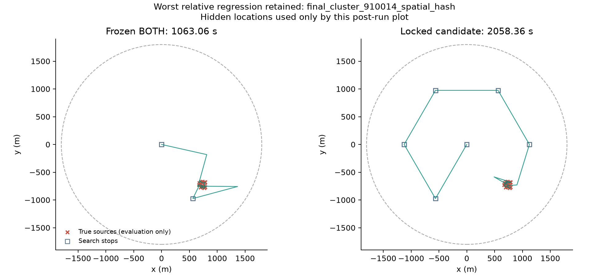

# 第三问全向源算法机制重探：最终报告

**结论：找到达到预设显著改进标准的候选，按均值、清除率和P95标准值得作为下一推荐版本。当前推荐BOTH未被覆盖。** 最终锁定 `GATED_TOUR_MULTI_PARALLAX`；两种舍入下平均完整流程时间分别降低10.27%和10.07%，均完整清除且P95下降。它不是逐案例优势：最差单例仍慢93.63%，聚集/窄径向类别没有达到各自5%均值收益。

本次没有官方演练、正式测试或云端推送。完成10种机制与有意义的组合/删除消融后，依据充分证据提前收束；**不是连续10轮失败**。R9不足1%的边际收益和R10零收益不当作新的5%突破，不用继承组合收益重置探索叙述。

## 最终未见布局的完整流程对照

源码、配置、选择规则和生成器锁定后，生成120个新布局，六类各20个；每布局四种固定误差场、两种舍入。每方案960局，但独立布局仅120个。最终矩阵同时含8个已锁定方案，共7680局。

| 模型 | 方案 | 均值/秒 | P95/秒 | 最大/秒 | 完整/总局 | 失败 | 超时 | 假完成 |
|---|---|---:|---:|---:|---:|---:|---:|---:|
| bounded | BOTH基线 | 3323.52 | 4517.29 | 5111.40 | 480/480 | 0 | 0 | 0 |
| bounded | 锁定候选 | 2982.18 | 3823.72 | 4217.81 | 480/480 | 0 | 0 | 0 |
| pre_round_stress | BOTH基线 | 3319.49 | 4505.79 | 5086.03 | 480/480 | 0 | 0 | 0 |
| pre_round_stress | 锁定候选 | 2985.19 | 3827.73 | 4217.91 | 480/480 | 0 | 0 | 0 |

120个布局按类别分层、以布局为块进行20000次配对bootstrap。均值相对变化的95%区间：主模型−11.35%至−9.14%，舍入压力−11.15%至−8.95%。这些区间只描述自建生成器下的采样不确定性，不能保证官方分布的收益。P95差值95%区间分别为−789.26至−534.00秒、−794.48至−531.29秒。

主模型435/480例更快、45例更慢；压力模型433/480例更快、47例更慢。失败惩罚预先固定为max(实际虚拟时间,360000秒)，未删除任何失败或慢例；本次性能矩阵没有失败局。

## 创新机制及为什么组合有效

旧BOTH主要围绕“保证较大交角的第二点→固定光学覆盖→缓存第二次测量”组织行动。新候选维护每个已知频道的完整保守位置集合：向不确定集合靠近，用新地点的有界方位收缩集合；首个移动检测增加随不确定尺度变化的适度视差，避免中心直进的径向反复折返。每次实际移动后，只对保证接收且所有可能输出均有足够收缩价值的其他频道共享测量。清除必须有整个候选集合落入20米圆的证书。

调度把当前集合中心与剩余搜索站放入同一滚动开路，执行首项后根据真实反馈重新规划。R6的最近入口消融已取得大部分收益，完整行程只是追加改善；不能把全部收益归功于2-opt。消融还表明，切换任务时额外原地再观测没有稳定贡献，因此最终删去。连续覆盖停止虽已实现，但开发轨迹没有变化，最终也不包含它。七站/16个成功清除的可靠停止证书保留。

这是相对项目原基线的机制变化，不声称文献首创或全局最优。几何命题、浮点实现和时间收益分级见[THEORY.md](THEORY.md)。

## 耗时分解：主模型平均每局

| 项目 | BOTH/秒 | 候选/秒 | 候选−BOTH/秒 |
|---|---:|---:|---:|
| 移动 | 2668.95 | 2285.70 | -383.25 |
| 切频 | 92.60 | 100.74 | +8.14 |
| 无线电检测 | 468.82 | 532.58 | +63.76 |
| 光学定位 | 67.88 | 37.90 | -29.98 |
| 激光清除 | 25.27 | 25.27 | +0.00 |

移动减少383.25秒，额外检测与切频增加71.90秒，光学减少29.98秒，净省341.33秒。所有动作完整计费；候选最终960局失败光学尝试为0，有限网格回退触发0次。题面逐局“总时间/清除数”的平均值，主模型269.71→242.21秒，压力模型269.36→242.38秒。阶段总时间另保存在FINAL_EVIDENCE.json的phase_means，阶段与动作分类不得重复相加。

## 各类场景与最坏退化

| 类别（每类20布局×4误差场） | BOTH均值/秒 | 候选均值/秒 | 均值变化 | BOTH P95 | 候选P95 |
|---|---:|---:|---:|---:|---:|
| cluster | 2072.50 | 1991.77 | -3.90% | 2674.41 | 2352.85 |
| min_radius | 4033.23 | 3475.93 | -13.82% | 4469.31 | 3849.53 |
| outer | 3331.12 | 3051.59 | -8.39% | 4328.35 | 3743.46 |
| radial | 2426.41 | 2403.08 | -0.96% | 2920.29 | 2866.02 |
| reception_edge | 4121.63 | 3518.64 | -14.63% | 4678.14 | 3928.17 |
| uniform | 3956.22 | 3452.11 | -12.74% | 4691.98 | 4028.66 |

最差相对退化 `final_cluster_910014_spatial_hash`：1063.06→2058.36秒，慢995.31秒/+93.63%。增加移动791.31秒、检测185秒、切频37秒，虽节省18秒失败光学仍明显变慢。压力批同例仍慢93.63%，另有径向 `910046_positive`：1343.14→2576.79秒，慢91.85%。聚集区域快速发现16源后提前结束搜索是基线的强项；新滚动路线使用集合中心代理，可能先扫更多站，使本可早结束的整局延长。

这是模型选择和任务终止时机的局限，不是删除失败光学就能消除。最终验证后没有针对这些案例调参、改机制或换候选。候选总体最大值虽更低，但单例相对遗憾仍大，故不能承诺逐场景替代。

## 十轮方法及负结果

| 轮次 | 主对照候选 | 原开发均值相对BOTH | 结论 |
|---|---|---:|---|
| [round01_homing](round01_homing/REVIEW.md) | HOMING | +11.44% | 中心直进虽然安全，但径向折返和旧任务评分增加移动；不采用单项。 |
| [round02_parallax](round02_parallax/REVIEW.md) | PARALLAX | +5.52% | 视差改善中心逼近，却未单独胜过冻结基线；作为组合因素保留。 |
| [round03_refresh](round03_refresh/REVIEW.md) | REFRESH_PARALLAX | +3.52% | 原地再观测单项仍失败；最终组合删除这一非必要步骤。 |
| [round04_shared](round04_shared/REVIEW.md) | SHARED_PARALLAX | +0.99% | 跨频道持续收缩减少重复定位，但仍需与新任务路线配合。 |
| [round05_strip](round05_strip/REVIEW.md) | STRIP | +92.18% | 单方位有限光学条带覆盖很昂贵；完整放弃。 |
| [round06_belief_tour](round06_belief_tour/REVIEW.md) | TOUR_SHARED_PARALLAX | -12.83% | 首次显著突破来自新信息集合与路线调度共同工作；最近入口消融表明完整2-opt只贡献一部分。 |
| [round07_reception_bracket](round07_reception_bracket/REVIEW.md) | RECEPTION_BRACKET | +525.62% | 边界成员查询可测距，但长距离往返压倒信息收益；放弃。 |
| [round08_survey](round08_survey/REVIEW.md) | SURVEY | +7.00% | 固定多站信息网络增加搜索检测和聚集案例绕行；放弃。 |
| [round09_information](round09_information/REVIEW.md) | GATED_TOUR_SHARED_PARALLAX | -13.67% | 相对直接父组合收益不足1%，不视作又一次5%突破；其有限观测价值证书与温和收益可留在候选。 |
| [round10_continuous_cover](round10_continuous_cover/REVIEW.md) | COVER_TOUR_SHARED_PARALLAX | -12.83% | 开发轨迹完全一致，连续覆盖证书未产生收益；最终候选不包含此机制。 |

所有轮次都有事前动机、实现快照、配置、动作与策略原始日志、两种舍入对照和REVIEW.md。R1最初4例探针也保留。完整负结果包括单方位光学清扫+92.18%和接收边界测距+525.62%，没有用局部效率替代完整流程结论。

## 消融与选择可追溯性

初始选择规则见SELECTION.md；开发消融揭示可删除原地再观测后，先记录SELECTION_AMENDMENT_1.md，再补同一结构开发测试，最后锁定简化版。最终数据在validation_lock.json写入后才生成，哈希与时间见validation_generation.json。最终验证后未改选；8个方案中最优均值也是事前选中的候选。

| 最终主模型方案 | 均值/秒 | P95/秒 | 作用 |
|---|---:|---:|---|
| BASE | 3323.52 | 4517.29 | 冻结BOTH |
| GATED_NEAREST_SHARED_PARALLAX | 3044.39 | 4085.55 | 完整父组合有门控、仅最近入口 |
| GATED_TOUR_MULTI_PARALLAX | 2982.18 | 3823.72 | 最终简化候选 |
| GATED_TOUR_SHARED | 3250.91 | 4111.08 | 完整父组合去视差 |
| GATED_TOUR_SHARED_PARALLAX | 3007.19 | 3822.14 | 加回被删除的目标原地再观测 |
| NEAREST_SHARED_PARALLAX | 3071.85 | 4129.81 | 完整父组合仅最近入口 |
| TOUR_REFRESH_PARALLAX | 3425.66 | 4137.94 | 完整父组合去跨频道共享 |
| TOUR_SHARED_PARALLAX | 3034.19 | 3839.33 | 完整父组合去信息门控 |

消融锚定“带目标再观测的完整父组合”，只有加/删目标再观测一项与最终简化候选是严格单因素对照；不能把表中所有差值都当最终候选的独立可加贡献。门控比较TOUR_SHARED_PARALLAX与GATED_TOUR_SHARED_PARALLAX；视差比较GATED_TOUR_SHARED与GATED_TOUR_SHARED_PARALLAX；全行程比较GATED_NEAREST_SHARED_PARALLAX与GATED_TOUR_SHARED_PARALLAX。共享的严格开发对照在R4；最终无共享臂同时没有共享门控，不能独立识别二者贡献。

## 对抗复核与验证边界

性能矩阵共15272局，全部完整清除，失败/超时/假完成均0；独立审计1975550条接受动作。104条冻结BASE结果与原第十九轮BOTH逐项完全一致。120个最终布局与60个结构开发布局种子分离；四种误差场以及两种舍入不当作独立布局数翻倍。每个候选无数值参数网格搜索，额外简化候选的预算修订已明示，历史基线19轮累计研发预算无法重新配平。

选中配置通过10项对抗测试：600组极端有界误差几何、角度跨零、信息区间覆盖、独立阴性圆方格证明、策略无真值/文件访问静态检查、同点误差固定、晚频道/边界/近点/聚集完整流程、现实截止、拒绝清除和保证点错误no_signal的安全失败。公开响应重放3个困难案例，传给策略的环境不存在源坐标、半径或误差类别对象；动作及时间完全复现。

另有2局实际本机自建HTTP成功并关闭服务器，端口由系统分配，未连接2026端口或官方程序。首次自建HTTP在enter前被沙箱禁止创建socket，保留self_http_check.log；获准本机socket后重试成功，见self_http_check_retry.log。这个基础设施失败不计作已进入场景的策略性能失败。

当前推荐配置、源码和87项冻结材料哈希均未改变。Windows、官方HTTP、官方场景/误差空间结构、文献新颖性和普遍最坏时间未验证。浮点余量与600组边界测试不是形式化区间算术证明；总体统计改进不推出所有场景改进。

## 替换建议及复现

**按本次预先约定的均值≥5%、清除率不降、P95不升标准，值得将锁定候选作为下一推荐方案；保留BOTH回退及上述聚集/径向退化记录。** 若实际更重视逐案例不退化而非本次约定指标，则证据尚不足以支持无条件替代。按照用户范围，工作区当前推荐文件维持原样，本次只提交独立候选。

入口文件：[候选配置](best_candidate.json)、[源码策略](strategy.py)、[数学依据](THEORY.md)、[全部机器可核对结论](FINAL_EVIDENCE.json)、[960条最终配对数据](final_paired.csv)、[验证锁](validation_lock.json)、[复现说明](REPRODUCE.md)。

停止依据是10类机制、开发与最终验证、关键移除消融和对抗反例已充分支持上述限定结论；继续为小幅收益堆机制不符合本次任务。未宣称已经穷尽算法空间或取得全局最优。
