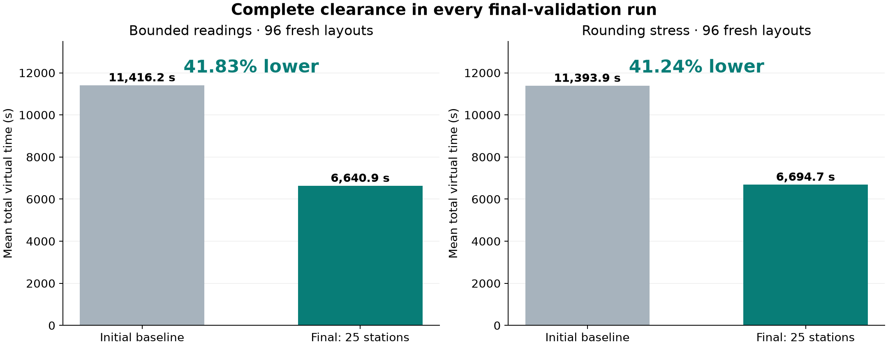
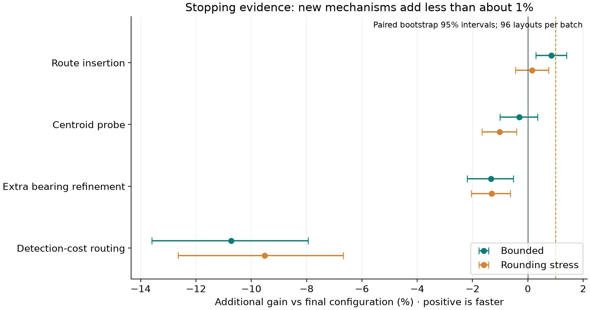

# 最终方案与实验结论

## 结论与交付范围

最终采用25站双环覆盖、面积重心驱动的开放路径规划、低信息量检测删减、已知16源上界停止，以及交会定位与光学覆盖兜底。配置为 `configs/recommended.json`。已满足用户设定的停止条件，停止进一步机制尝试，不宣称全局最优。

共15批、5376次自建运行，所有配置均完成了每局全部目标的清除，并通过运行后独立物理、计时与停止证书审计。该数量包括同一布局上的多个对照和开发集复用，不能写成5376个独立测试案例。最终验收为两批各96个此前未使用的布局，共192个独立新布局；每批比较9种配置，共1728次最终运行。

官方演练、三次正式测试、Windows运行与官方加密日志导出均未执行。交付提供可连接已就绪第四问演练界面的HTTP入口；这里的表格不能当作题目要求的三次官方正式测试表。

## 最终主指标

| 批次 | 初始基线整局均值 / 秒 | 最终方案整局均值 / 秒 | 均值降幅 | 配对bootstrap 95%区间 | 基线P95 / 秒 | 最终P95 / 秒 | 最终完整清除 |
|---|---:|---:|---:|---:|---:|---:|---:|
| 新布局、读数包络 | 11416.24 | 6640.86 | 41.83% | [40.35%, 43.24%] | 13465.02 | 8694.62 | 96/96 |
| 另一批新布局、舍入压力 | 11393.93 | 6694.69 | 41.24% | [39.70%, 42.79%] | 14367.42 | 9598.33 | 96/96 |

降幅定义为 `1 - mean(T_candidate) / mean(T_reference)`；与逐例降幅的简单平均不同。bootstrap使用10000次配对重采样，以独立布局为单位。区间描述本次自建案例分布下的抽样变化，不是对未知官方案例分布的保证。两批布局互不相同，也没有把同布局的两个舍入结果当作两个独立样本。

192个最终新布局中，推荐版均快于初始基线；最小单例降幅分别为7.97%和6.60%。六类布局分别为普通分布、外缘朝外、外缘朝内、切向、聚簇和一般外缘；最终每批每类16个。源数10—16、不同定向源比例与四类误差场都有覆盖。两批各家族的均值降幅均为正，详细分组见 `results/round9_review.json`。

## 主要收益来源

最终主批次的移动耗时从9163.35秒下降到4588.99秒，是主要收益来源；检测耗时从1730.10秒下降到1627.76秒，光学耗时从177.44秒下降到95.38秒。全部成功清除的激光耗时保持相同。

推荐配置移除重心调度后，最终两批整局均值分别上升13.10%和11.90%；移除低信息量检测删减后，分别上升4.61%和4.56%。后者主要是额外检测和切换频道的直接开销：主批次多检测约258.13秒、多切换约50.71秒，移动耗时几乎未变。

核心完整性来自覆盖证书和光学兜底，收益来自启发式访问顺序与检测删减。面积重心不被当作真实位置；第三问“无信号排除圆盘”的推理没有移植到第四问。

## 22站与25站的组合效应

研发过程中确实构造并验证了22站连续区域覆盖证书。重心调度启用前，它在独立72布局中比25站方案平均快约2.41%。但加入重心调度后，预选22站方案在新的两批96布局消融中落后于25站，遂取消预选并重新封存验证。

最终两批中，同样的其余机制下，22站版本比25站版本分别慢5.24%和3.39%。主批次22站少用约192.14秒检测，却多走约538.46秒的路，净效果为负。**测站数最少与整局虚拟时间最短不是等价目标。** 这些阶段结果各有冻结配置和新布局记录，不能仅保留22站曾经胜出的阶段。

## 停止依据

下表为相对最终25站推荐版的新增收益；正值代表更快。各候选在两批运行中均完整清除。

| 后续机制 | 新布局主批次收益 | 新布局舍入压力收益 | 取舍 |
|---|---:|---:|---|
| 路线插入重排 | +0.86% | +0.15% | 均低于约1%；后一批95%区间跨零，未加入推荐 |
| 把测向点移到区域重心附近 | -0.31% | -1.02% | 不采纳 |
| 补充第三条示向度 | -1.34% | -1.31% | 不采纳 |
| 在路线目标中加入未来检测费用 | -10.73% | -9.51% | 不采纳 |

路线插入重排的两个95%区间分别约为[0.30%,1.41%]和[-0.45%,0.75%]，并有单例变慢11.53%。继续尝试的几个合理机制未显示稳定超过约1%的新增收益；21站具体候选还存在真实漏检反例，25站与22站选择已完成独立复验。目前没有新的明显高收益空间，按用户约定停止。此结论是对已探索机制的经验收敛判断，不是几何站数下界或全局最优证明。

## 实验治理与复现

每批先将代码SHA256、配置和生成计划写入 `lock.json`，随后生成fixture；独立批次使用新种子。运行目录还保存当时源码快照。早期部分开发批次重用24个布局，均标注development，不冒充独立验证。

前几轮生成器的定向比例由种子余数决定，与按序分配的家族存在关联；其原始结果完整保留，没有重写。第六轮起把定向源数量改为独立随机选择，最终各家族与空间误差规律交叉覆盖。四类误差为位置固定的哈希误差、全局+1°、全局-1°和光滑空间场。主环境约束最终读数误差不超过1°；压力环境先加误差再两位小数舍入，可能达到1.005°，策略包络覆盖两者。

策略模块只导入公共几何与路径规划，不导入案例生成器或模拟器。隐藏位置、半径、方向和误差种子仅供环境生成响应，运行结束后才由独立审计读取。审计重新计算方向可见性、读数误差、光学成功与全部虚拟计时，同时核实停止证书。

最终源码与 `round9_main/lock.json`、`round9_rounding/lock.json` 一致。16项测试通过，包括默认推荐配置的真实loopback HTTP往返。测试最初因沙箱禁止创建socket而失败，获准监听本机临时端口后通过；这不是算法清除失败。丢失已执行响应、重试耗尽、业务拒绝、证书篡改和不一致读数另有故障测试，不能混入合法成绩。

自建进程内最终策略单局记录的最长运行时间约0.08秒；此值不代表官方网络及窗口下的程序运行时间。运行环境与每批结果一起记录，主实验为Python3.13.12、NumPy2.4.4、SciPy1.17.1。

## 证据入口

完整性推导见 `模型与完整性证明.md`。失败案例及机制否决见 `失败与负结果.md`。批次总索引为 `results/experiment_index.json`；最终配对统计为 `results/round9_review.json`。历史命名为 `final_main`、`final_rounding` 的批次属于22站预选失败后的保留记录，最终推荐以第九轮为准。

运行包为 `releases/q4_recommended.zip`；完整自建原始记录为 `releases/q4_experiment_evidence.tar.gz`，带逐文件清单及外部SHA256。两个包的内容和哈希须通过发布验证后使用。此前第一至三问的 `paper_evidence/` 未被覆写，也不承担保存第四问证据的职责。
