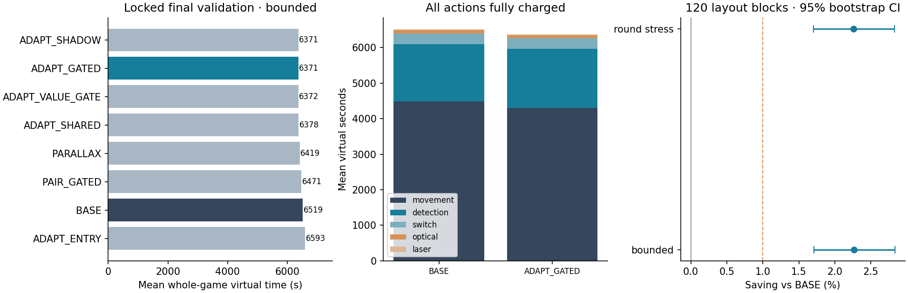
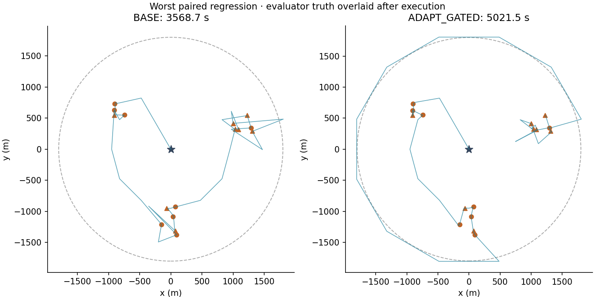

# 第四问定向适配机制追加实验：最终报告

**结论：已完成机制探索并停止继续加机制。锁定候选 ADAPT_GATED 在最后120个未见布局上，将原25站推荐的整局平均虚拟时间降低2.26%，P95降低6.02%；全部清除。收益温和，不能直接迁入第三问约10%的结果。原推荐文件及历史证据保持原样，本轮提供独立候选与完整复现材料。**

最终候选为25站原覆盖＋原重心调度＋尺度视差自适应定位＋定位/清除移动后的跨频道共享＋共享正向响应条件收缩门控。最终确认前已固定候选及八臂矩阵，之后没有调参、改算法或换候选。阴性影区分支最终均值还低约0.25秒/局，未为这约0.004%的差异事后改选。

## 最终独立成绩

每种舍入为120个布局×4种固定空间误差，480局/方案；两种舍入属于同一120布局，不算240个独立样本。六类各20布局，按布局分块、按类别分层10000次配对bootstrap。

| 舍入模型 | 方案 | 均值/秒 | P95/秒 | 最大/秒 | 完整/总局 | 均值收益 |
|---|---|---:|---:|---:|---:|---:|
| bounded | 冻结25站 | 6518.60 | 9046.87 | 10756.69 | 480/480 | 0.000% |
| bounded | 锁定候选 | 6371.09 | 8502.70 | 10285.11 | 480/480 | 2.263% |
| pre_round_stress | 冻结25站 | 6518.62 | 9047.15 | 10756.70 | 480/480 | 0.000% |
| pre_round_stress | 锁定候选 | 6371.47 | 8502.70 | 10280.42 | 480/480 | 2.257% |

- bounded：均值收益95%区间 **[1.709%, 2.832%]**；337局更快、143局更慢。
- pre_round_stress：均值收益95%区间 **[1.704%, 2.828%]**；336局更快、144局更慢。

最终八臂7680局无策略失败、超时、假完成或审计失败。性能排序以完整清除为硬约束，失败预设惩罚为max(实际虚拟时间,360000秒)，没有删除失败或慢例。区间只描述自建生成器的布局采样不确定性，六类及四种误差是设定的压力组合，不代表官方分布。

## 定向适配做了什么

第四问的接收集合是圆盘与发射半平面的交集，距离小于1000米甚至5米都不能推出有信号。所有新机制只由正向方位收缩保守位置集合；`no_signal`保持集合不变。中心或尺度视差测点最多尝试8步，没信号或收缩不足就回到20米包含圆清除证书/原有限光学覆盖。未知频道的25站完整覆盖与16源成功清除停止证书保持。

共享仅在已经实际移动到的新位置，对其他已知频道额外测量；全部切频和检测照常计费。信息门控用16个扩大角区间覆盖可能的正向响应，只能保证“若收到方位则足够收缩”。它不覆盖无信号分支，不是定向接收保证，也不是净时间收益证明。同一频道同一点的阴性尝试也去重。详见 [THEORY.md](THEORY.md)。

另实现并审计了方向阴性影区证书：若某阴性点到整个当前候选集合均小于1000米，其阴性可归因于方向；结合正测点锥组合可证明一些后续位置仍在背面，从而跳过必无信号的共享。它安全可行，但实际边际收益极小，最终候选未加入。

## 时间省在哪里：主模型每局

| 动作组件 | 冻结25站/秒 | 候选/秒 | 候选−对照/秒 |
|---|---:|---:|---:|
| 移动 | 4490.29 | 4306.79 | -183.49 |
| 切频 | 297.79 | 307.36 | +9.56 |
| 无线电检测 | 1601.80 | 1654.71 | +52.91 |
| 光学 | 102.48 | 76.00 | -26.48 |
| 激光 | 26.23 | 26.23 | +0.00 |

移动减少183.49秒、光学减少26.48秒，被额外检测52.91秒和切频9.56秒部分抵消，净省147.50秒。只看定位或光学阶段会夸大收益：原光学兜底902.45秒降到193.16秒，但新增自适应定位886.71秒，清除前移动也重新分配。搜索阶段仅4680.19→4664.75秒，仍占候选总时间约73.2%。阶段与动作组件是两种分组，不能重复相加；完整阶段表保存在FINAL_BY_ROUNDING.json。

## 严格消融与合理负结果

| 最终主模型方案 | 均值/秒 | P95/秒 | 对照作用 |
|---|---:|---:|---|
| BASE | 6518.60 | 9046.87 | 冻结25站 |
| PARALLAX | 6418.55 | 8731.99 | 仅尺度自适应、无途中共享 |
| ADAPT_SHARED | 6378.29 | 8475.30 | 尺度自适应＋无门控共享 |
| ADAPT_GATED | 6371.09 | 8502.70 | 事前锁定候选 |
| PAIR_GATED | 6471.40 | 8978.06 | 删去自适应，恢复固定pair |
| ADAPT_SHADOW | 6370.85 | 8502.70 | 候选加定向阴性影区删减 |
| ADAPT_VALUE_GATE | 6372.26 | 8502.70 | 候选加定位提案门控 |
| ADAPT_ENTRY | 6592.77 | 9741.69 | 候选加最近光学入口（负结果） |

- 途中共享严格对照 ADAPT_SHARED/PARALLAX：最终合并均值边际收益0.623%。
- 共享门控严格对照 ADAPT_GATED/ADAPT_SHARED：最终合并均值边际收益0.112%。
- 自适应定位严格对照 ADAPT_GATED/PAIR_GATED：最终合并均值边际收益1.553%。

这些贡献不可相加：共享会改变位置集合、任务顺序和后续误差采样位置，存在机制交互。最终确认的其他臂用于描述性消融，不作多重比较校正后的独立显著性宣称。

第二轮独立验证事前锁定的新方向均未达到约1%的稳定边际收益。`ADAPT_ENTRY_SHADOW`同时改变入口与影区两个因素，是组合实验，不能称为单因素消融：

| 新因素/父方案 | 边际收益 | 布局bootstrap 95%区间 |
|---|---:|---:|
| ADAPT_ENTRY / ADAPT_GATED | -3.5969% | [-4.7804%, -2.4006%] |
| ADAPT_SHADOW / ADAPT_GATED | +0.0187% | [+0.0067%, +0.0330%] |
| ADAPT_ENTRY_SHADOW / ADAPT_GATED | -3.5048% | [-4.6564%, -2.3369%] |
| ADAPT_VALUE_GATE / ADAPT_GATED | -0.0132% | [-0.0387%, +0.0116%] |
| PAIR_ENTRY / PAIR_GATED | -2.9528% | [-3.8999%, -1.9453%] |
| CENTER_BLIND / CENTER | +0.2266% | [+0.0915%, +0.3829%] |

最近入口只重新排列原光学网格，完整性不变，却会改变提前命中顺序与后续共享。它在开发集和独立验证均使整局变慢；不能把第一段移动更短当作整体优势。中心无信号后原地3秒光学尝试有物理动机，但只省约0.23%，没有必要继续阈值搜索。中心直进在R1独立验证慢0.88%，R2约省0.50%，也不稳定。

## 最坏退化与场景差异

最差相对案例 `cluster_37a7f070473c076e__spatial_hash__bounded`（seed191046）：3568.65→5021.47秒，**慢1452.81秒/+40.71%**，舍入压力下同样出现。两方案均成功清除16源。原推荐访问12站即终止，候选访问18站；移动增加1009.81秒、检测增加440秒、切频增加75秒，虽然光学省72秒，仍明显变慢。失败光学次数反而从25次降为1次，再次说明应按整局总时间评价。

这属于信息更新改变在线调度和16源提前停止时机的代价。最终验证后没有针对该案例改机制或换候选。总体P95和最大值下降不代表逐例支配。

| 场景（每类20布局×4误差×2舍入） | 对照均值/秒 | 候选均值/秒 | 均值收益 | 候选P95/秒 |
|---|---:|---:|---:|---:|
| cluster | 5926.04 | 5804.82 | 2.046% | 6933.00 |
| edge | 6497.65 | 6448.11 | 0.762% | 7473.72 |
| inward | 5431.61 | 5405.97 | 0.472% | 5892.96 |
| outward | 7348.37 | 7155.25 | 2.628% | 9545.89 |
| tangent | 7313.53 | 6887.93 | 5.819% | 8642.70 |
| uniform | 6594.47 | 6525.61 | 1.044% | 8125.11 |

切向场景收益最明显；inward和edge类别均值不足1%。类别结论是本生成器下的分组描述。

## 实验数量、冻结与完整性

| 批次 | 阶段 | 布局数 | 算法局数 | 完整/审计通过 |
|---|---|---:|---:|---:|
| round01_dev | development | 24 | 336 | 336 |
| round01_validation | independent_validation | 48 | 2688 | 2688 |
| round02_dev | development_reused_layouts | 24 | 480 | 480 |
| round02_validation | independent_validation | 48 | 3840 | 3840 |
| final_validation | final_independent_validation | 120 | 7680 | 7680 |

合计 **15,024局性能矩阵**、**240个不同布局**、独立物理审计 **5,570,451条接受动作**。R2开发复用R1的24布局；两批中期独立验证各48布局，最后120布局，与开发及全部历史第四问fixture无重叠。误差和舍入重放不计作新布局。

24项自建测试通过，含720次极值方位区域检查、400组定向影区随机物理检查、方向/距离/近场边界及协议故障；另有12个历史BASE案例逐项复现、3个困难案例在只有公开响应的Replay上逐动作和时间完全复现。性能矩阵数不包含这些额外单元/复现检查。

原源码、配置、文档、历史结果和第三问最终报告等 **16,427个冻结文件SHA256全部未变**。R2修复了分析器拒绝不完整矩阵及框架异常记录；R1旧快照和原始锁保留。R1选择锁的交叉轴元数据笔误已另加PROVENANCE说明，实际事前决策、执行锁和4×2矩阵一致，没有重写旧锁。

## 停止与使用建议

停止发生在最后120布局生成前：多个合理新增方向独立收益稳定低于约1%或为负；剩余主要耗时来自25站未知频道搜索，本轮没有新的更短定向覆盖/停止证书，历史22站及路线微调也无优势。因此停止继续堆叠机制，不宣称全局最优或穷尽全部空间。

按本次“完整清除＋整局均值”目标，ADAPT_GATED可作为下一实验候选，最后独立均值与P95均优于冻结对照；原推荐保留供回退。官方测试、官方误差/场景分布、Windows及HTTP上线集成均未验证；本轮没有启动官方测试、官方程序或推送云端。

入口：[候选配置](best_candidate.json)、[冻结选择](FINAL_SELECTION.md)、[源码](strategy.py)、[数学依据](THEORY.md)、[复现](REPRODUCE.md)、[机器可核对结论](FINAL_EVIDENCE.json)、[最终配对宽表](final_paired.csv)、[停止证据](STOPPING_EVIDENCE.json)、[代表性案例](REPRESENTATIVE_CASES.json)。
